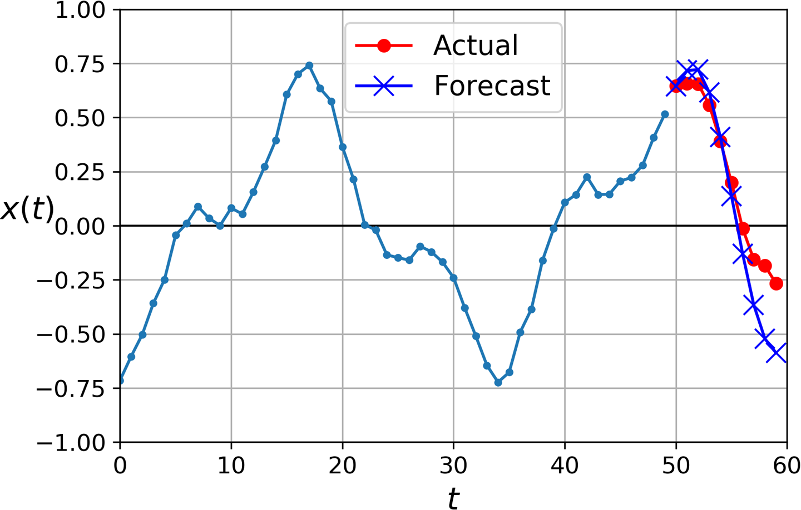

[Chapter 15. ] Processing Sequences Using [RNNs and CNNs]{.keep-together}
================================================================================

The[]{#idm45728453118520} batter hits the ball. The outfielder
immediately starts running, anticipating the ball's trajectory. He
tracks it, adapts his movements, and finally catches it (under a thunder
of applause). Predicting the future is something you do all the time,
whether you are finishing a friend's sentence or anticipating the smell
of coffee at breakfast. In this chapter we will discuss recurrent neural
networks (RNNs), a class of nets that can predict the future (well, up
to a point, of course). They[]{#idm45728453116888} can analyze time
series data such as stock prices, and tell you when to buy or sell.
In[]{#idm45728453115672} autonomous driving systems, they can anticipate
car trajectories and help avoid accidents. More generally,
they[]{#idm45728453114776} can work on sequences of arbitrary lengths,
rather than on fixed-sized inputs like all the nets we have considered
so far. For example, they can take sentences, documents, or audio
samples as input, making[]{#idm45728453113480} them extremely useful for
natural language processing applications such as automatic translation
or speech-to-text.

In this chapter we will first look at the fundamental concepts
underlying RNNs and how to train them using backpropagation through
time, then we will use them to forecast a time series. After that we'll
explore the two main difficulties that RNNs face:

-   Unstable gradients (discussed in
    [Chapter 11](https://learning.oreilly.com/library/view/hands-on-machine-learning/9781492032632/ch11.html#deep_chapter)),
    which can be alleviated using various techniques, including
    recurrent dropout and recurrent layer normalization

-   A (very) limited short-term memory, which can be extended using LSTM
    and GRU cells

RNNs are not the only types of neural networks capable of handling
sequential data: for small sequences, a regular dense network can do the
trick; and for very long sequences, such as audio samples or text,
convolutional neural networks can actually work quite well too. We will
discuss both of these possibilities, and we will finish this
chapter[]{#idm45728453107848} by implementing a *WaveNet*: this is a CNN
architecture capable of handling sequences of tens of thousands of time
steps. In
[Chapter 16](https://learning.oreilly.com/library/view/hands-on-machine-learning/9781492032632/ch16.html#nlp_chapter),
we will continue to explore RNNs and see how to use them for natural
language processing, along with more recent architectures based on
attention mechanisms. Let's get started!


Recurrent Neurons and Layers
============================

Up[]{#RNNneurons15}[]{#Nrecurr15}[]{#Lrecurr15} to now we have focused
on feedforward neural networks, where the activations flow only in one
direction, from the input layer to the output layer (a few exceptions
are discussed in
[Appendix E](https://learning.oreilly.com/library/view/hands-on-machine-learning/9781492032632/app05.html#other_ann_appendix)).
A recurrent neural network looks very much like a feedforward neural
network, except it also has connections pointing backward. Let's look at
the simplest possible RNN, composed of one neuron receiving inputs,
producing an output, and sending that output back to itself, as shown in
[Figure 15-1](https://learning.oreilly.com/library/view/hands-on-machine-learning/9781492032632/ch16.html#simple_rnn_diagram)
(left). At[]{#idm45728453097384}[]{#idm45728453096680} each *time step*
*t* (also called a *frame*), this *recurrent neuron* receives the inputs
**x**~(*t*)~ as well as its own output from the previous time step,
*y*~(*t*--1)~. Since there is no previous output at the first time step,
it is generally set to 0. We can represent this tiny network against the
time axis, as shown in
[Figure 15-1](https://learning.oreilly.com/library/view/hands-on-machine-learning/9781492032632/ch16.html#simple_rnn_diagram)
(right). This[]{#idm45728453090696} is called *unrolling the network
through time* (it's the same recurrent neuron represented once per time
step).


You can easily create a layer of recurrent neurons. At each time step
*t*, every neuron receives both the input vector **x**~(*t*)~ and the
output vector from the previous time step **y**~(*t*--1)~, as shown in
[Figure 15-2](https://learning.oreilly.com/library/view/hands-on-machine-learning/9781492032632/ch16.html#rnn_layer_diagram).
Note that both the inputs and outputs are vectors now (when there was
just a single neuron, the output was a scalar).


Each recurrent neuron has two sets of weights: one for the inputs
**x**~(*t*)~ and the other for the outputs of the previous time step,
**y**~(*t*--1)~. Let's call these weight vectors **w**~*x*~ and
**w**~*y*~. If we consider the whole recurrent layer instead of just one
recurrent neuron, we can place all the weight vectors in two weight
matrices, **W**~*x*~ and **W**~*y*~. The output vector of the whole
recurrent layer can then be computed pretty much as you might expect, as
shown in [Equation
15-1](https://learning.oreilly.com/library/view/hands-on-machine-learning/9781492032632/ch16.html#rnn_output_equation)
(**b** is the bias vector and *ϕ*(·) is the activation function (e.g.,
ReLU^[1](https://learning.oreilly.com/library/view/hands-on-machine-learning/9781492032632/ch15.html#idm45728453072056){#idm45728453072056-marker
.totri-footnote}^).


##### [Equation 15-1. ] Output of a recurrent layer for a single instance

$\mathbf{y}_{(t)} = \phi\left( {{\mathbf{W}_{x}}^{\intercal}\mathbf{x}_{(t)}\, + \,{\mathbf{W}_{y}}^{\intercal}\mathbf{y}_{(t - 1)}\, + \,\mathbf{b}} \right)$


Just as with feedforward neural networks, we can compute a recurrent
layer's output in one shot for a whole mini-batch by placing all the
inputs at time step *t* in an input matrix **X**~(*t*)~ (see [Equation
15-2](https://learning.oreilly.com/library/view/hands-on-machine-learning/9781492032632/ch16.html#rnn_output_vectorized_equation)).


##### [Equation 15-2. ] Outputs of a layer of recurrent neurons for all instances in a mini-batch

$$\begin{array}{cl}
\mathbf{Y}_{(t)} & {= \phi\left( {\mathbf{X}_{(t)}\mathbf{W}_{x} + \mathbf{Y}_{(t - 1)}\mathbf{W}_{y} + \mathbf{b}} \right)} \\
 & {= \phi\left( {\left\lbrack {\mathbf{X}_{(t)}\mathbf{Y}_{(t - 1)}} \right\rbrack\mathbf{W} + \mathbf{b}} \right)\text{with}\mathbf{W} = \begin{bmatrix}
\mathbf{W}_{x} \\
\mathbf{W}_{y} \\
\end{bmatrix}} \\
\end{array}$$


In this equation:

-   **Y**~(*t*)~ is an *m* × *n*~neurons~ matrix containing the layer's
    outputs at time step *t* for each instance in the mini-batch (*m* is
    the number of instances in the mini-batch and *n*~neurons~ is the
    number of neurons).

-   **X**~(*t*)~ is an *m* × *n*~inputs~ matrix containing the inputs
    for all instances (*n*~inputs~ is the number of input features).

-   **W**~*x*~ is an *n*~inputs~ × *n*~neurons~ matrix containing the
    connection weights for the inputs of the current time step.

-   **W**~*y*~ is an *n*~neurons~ × *n*~neurons~ matrix containing the
    connection weights for the outputs of the previous time step.

-   **b** is a vector of size *n*~neurons~ containing each neuron's bias
    term.

-   The weight matrices **W**~*x*~ and **W**~*y*~ are often concatenated
    vertically into a single weight matrix **W** of shape (*n*~inputs~ +
    *n*~neurons~) × *n*~neurons~ (see the second line of [Equation
    15-2](https://learning.oreilly.com/library/view/hands-on-machine-learning/9781492032632/ch16.html#rnn_output_vectorized_equation)).

-   The notation \[**X**~(*t*)~ **Y**~(*t*--1)~\] represents the
    horizontal concatenation of the matrices **X**~(*t*)~ and
    **Y**~(*t*--1)~.

Notice that **Y**~(*t*)~ is a function of **X**~(*t*)~ and
**Y**~(*t*--1)~, which is a function of **X**~(*t*--1)~ and
**Y**~(*t*--2)~, which is a function of **X**~(*t*--2)~ and
**Y**~(*t*--3)~, and so on. This makes **Y**~(*t*)~ a function of all
the inputs since time *t* = 0 (that is, **X**~(0)~, **X**~(1)~, ...,
**X**~(*t*)~). At the first time step, *t* = 0, there are no previous
outputs, so they are typically assumed to be all zeros.


Memory Cells
------------

Since[]{#idm45728452967128}[]{#idm45728452966424} the output of a
recurrent neuron at time step *t* is a function of all the inputs from
previous time steps, you could say it has a form of *memory*. A part of
a neural network that preserves some state across time steps is called a
*memory cell* (or simply a *cell*). A single recurrent neuron, or a
layer of recurrent neurons, is a very basic cell, capable of learning
only short patterns (typically about 10 steps long, but this varies
depending on the task). Later in this chapter, we will look at some more
complex and powerful types of cells capable of learning longer patterns
(roughly 10 times longer, but again, this depends on the task).

In general a cell's state at time step *t*, denoted **h**~(*t*)~ (the
"h" stands for "hidden"), is a function of some inputs at that time step
and its state at the previous time step: **h**~(*t*)~ =
*f*(**h**~(*t*--1)~, **x**~(*t*)~). Its output at time step *t*, denoted
**y**~(*t*)~, is also a function of the previous state and the current
inputs. In the case of the basic cells we have discussed so far, the
output is simply equal to the state, but in more complex cells this is
not always the case, as shown in
[Figure 15-3](https://learning.oreilly.com/library/view/hands-on-machine-learning/9781492032632/ch16.html#hidden_state_diagram).


Input and Output Sequences
--------------------------

An[]{#idm45728452950312}[]{#idm45728452949336} RNN can simultaneously
take a sequence of inputs and produce a sequence of outputs (see the
top-left network in
[Figure 15-4](https://learning.oreilly.com/library/view/hands-on-machine-learning/9781492032632/ch16.html#seq_to_seq_diagram)).
This type of *sequence-to-sequence network* is useful for predicting
time series such as stock prices: you feed it the prices over the last
*N* days, and it must output the prices shifted by one day into the
future (i.e., from *N* -- 1 days ago to tomorrow).

Alternatively, you could feed the network a sequence of inputs and
ignore all outputs except for the last one (see the top-right network in
[Figure 15-4](https://learning.oreilly.com/library/view/hands-on-machine-learning/9781492032632/ch16.html#seq_to_seq_diagram)).
In other words, this[]{#idm45728452945000} is a *sequence-to-vector
network*. For example, you could feed the network a sequence of words
corresponding to a movie review, and the network would output a
sentiment score (e.g., from --1 \[hate\] to +1 \[love\]).

Conversely, you could feed the network the same input vector over and
over again at each time step and let it output a sequence (see the
bottom-left network of
[Figure 15-4](https://learning.oreilly.com/library/view/hands-on-machine-learning/9781492032632/ch16.html#seq_to_seq_diagram)).
This[]{#idm45728452942200} is a *vector-to-sequence network*. For
example, the input could be an image (or the output of a CNN), and the
output could be a caption for that image.

Lastly, you could have a sequence-to-vector network,
called[]{#idm45728452940248}[]{#idm45728452939464} an *encoder*,
followed by a vector-to-sequence network, called a *decoder* (see the
bottom-right network of
[Figure 15-4](https://learning.oreilly.com/library/view/hands-on-machine-learning/9781492032632/ch16.html#seq_to_seq_diagram)).
For example, this could be used for translating a sentence from one
language to another. You would feed the network a sentence in one
language, the encoder would convert this sentence into a single vector
representation, and then the decoder would decode this vector into a
sentence in another language. This two-step model,
called[]{#idm45728452936584} an *Encoder--Decoder*, works much better
than trying to translate on the fly with a single sequence-to-sequence
RNN (like the one represented at the top left): the last words of a
sentence can affect the first words of the translation, so you need to
wait until you have seen the whole sentence before translating it. We
will see how to implement an Encoder--Decoder in
[Chapter 16](https://learning.oreilly.com/library/view/hands-on-machine-learning/9781492032632/ch16.html#nlp_chapter)
(as we will see, it is a bit more complex than in
[Figure 15-4](https://learning.oreilly.com/library/view/hands-on-machine-learning/9781492032632/ch16.html#seq_to_seq_diagram)
suggests).


Sounds promising, but how do you train a recurrent neural
network?[]{#idm45728452930904}[]{#idm45728452929848}[]{#idm45728452928904}


Training RNNs
=============

To[]{#idm45728452926552} train an RNN, the trick is to unroll it through
time (like we just did) and then simply use regular backpropagation (see
[Figure 15-5](https://learning.oreilly.com/library/view/hands-on-machine-learning/9781492032632/ch16.html#bptt_diagram)).
This[]{#idm45728452924504} strategy is called *backpropagation through
time* (BPTT).

Just like in regular backpropagation, there is a first forward pass
through the unrolled network (represented by the dashed arrows). Then
the output sequence is evaluated using a cost function *C*(**Y**~(0)~,
**Y**~(1)~, ...**Y**~(*T*)~) (where *T* is the max time step). Note that
this cost function may ignore some outputs, as shown in
[Figure 15-5](https://learning.oreilly.com/library/view/hands-on-machine-learning/9781492032632/ch16.html#bptt_diagram)
(for example, in a sequence-to-vector RNN, all outputs are ignored
except for the very last one). The gradients of that cost function are
then propagated backward through the unrolled network (represented by
the solid arrows). Finally the model parameters are updated using the
gradients computed during BPTT. Note that the gradients flow backward
through all the outputs used by the cost function, not just through the
final output (for example, in
[Figure 15-5](https://learning.oreilly.com/library/view/hands-on-machine-learning/9781492032632/ch16.html#bptt_diagram)
the cost function is computed using the last three outputs of the
network, **Y**~(2)~, **Y**~(3)~, and **Y**~(4)~, so gradients flow
through these three outputs, but not through **Y**~(0)~ and **Y**~(1)~).
Moreover, since the same parameters **W** and **b** are used at each
time step, backpropagation will do the right thing and sum over all time
steps.


Fortunately, tf.keras takes care of all of this complexity for you---so
let's start coding!


Forecasting a Time Series
=========================

Suppose[]{#RNNforecast15}[]{#Sforecast15}[]{#idm45728452904712} you are
studying the number of active users per hour on your website, or the
daily temperature in your city, or your company's financial health,
measured quarterly using multiple metrics. In all these cases, the data
will be a sequence of one or more values per time step. This is called a
*time series*. In[]{#idm45728452902952} the first two examples there is
a single value per time step, so these are *univariate time series*,
while in the financial example there are multiple values per time step
(e.g., the company's revenue, debt, and so on), so[]{#idm45728452901560}
it is a *multivariate time series*. A typical task is to predict future
values, which[]{#idm45728452900232} is called *forecasting*. Another
common task is to fill in the blanks: to predict (or rather "postdict")
missing values from the past. This[]{#idm45728452898872} is called
*imputation*. For example,
[Figure 15-6](https://learning.oreilly.com/library/view/hands-on-machine-learning/9781492032632/ch16.html#time_series_plot)
shows 3 univariate time series, each of them 50 time steps long, and the
goal here is to forecast the value at the next time step (represented by
the X) for each of them.


For simplicity, we are using a time series generated by the
`generate_time_series()` function, shown here:

``` {data-type="programlisting" code-language="python"}
def generate_time_series(batch_size, n_steps):
    freq1, freq2, offsets1, offsets2 = np.random.rand(4, batch_size, 1)
    time = np.linspace(0, 1, n_steps)
    series = 0.5 * np.sin((time - offsets1) * (freq1 * 10 + 10))  #   wave 1
    series += 0.2 * np.sin((time - offsets2) * (freq2 * 20 + 20)) # + wave 2
    series += 0.1 * (np.random.rand(batch_size, n_steps) - 0.5)   # + noise
    return series[..., np.newaxis].astype(np.float32)
```

This function creates as many time series as requested (via the
`batch_size` argument), each of length `n_steps`, and there is just one
value per time step in each series (i.e., all series are univariate).
The function returns a NumPy array of shape \[*batch size*, *time
steps*, 1\], where each series is the sum of two sine waves of fixed
amplitudes but random frequencies and phases, plus a bit of noise.


###### Note

When dealing with time series (and other types of sequences such as
sentences), the input features are generally represented as 3D arrays of
shape \[*batch size*, *time steps*, *dimensionality*\], where
*dimensionality* is 1 for univariate time series and more for
multivariate time series.


Now let's create a training set, a validation set, and a test set using
this function:

``` {data-type="programlisting" code-language="python"}
n_steps = 50
series = generate_time_series(10000, n_steps + 1)
X_train, y_train = series[:7000, :n_steps], series[:7000, -1]
X_valid, y_valid = series[7000:9000, :n_steps], series[7000:9000, -1]
X_test, y_test = series[9000:, :n_steps], series[9000:, -1]
```

`X_train` contains 7,000 time series (i.e., its shape is \[7000, 50,
1\]), while `X_valid` contains 2,000 (from the 7,000th time series to
the 8,999th) and `X_test` contains 1,000 (from the 9,000^th^ to the
9,999^th^). Since we want to forecast a single value for each series,
the targets are column vectors (e.g., `y_train` has a shape of \[7000,
1\]).


Baseline Metrics
----------------

Before[]{#idm45728452632584}[]{#idm45728452631576} we start using RNNs,
it is often a good idea to have a few baseline metrics, or else we may
end up thinking our model works great when in fact it is doing worse
than basic models. For example, the simplest approach is to predict the
last value in each series. This is called *naive forecasting*, and it is
sometimes surprisingly difficult to outperform. In this case,
it[]{#idm45728452630104} gives us a mean squared error of about 0.020:

``` {data-type="programlisting" code-language="pycon"}
>>> y_pred = X_valid[:, -1]
>>> np.mean(keras.losses.mean_squared_error(y_valid, y_pred))
0.020211367
```

Another simple approach is to use a fully connected network. Since it
expects a flat list of features for each input, we need to add a
`Flatten` layer. Let's just use a simple Linear Regression model so that
each prediction will be a linear combination of the values in the time
series:

``` {data-type="programlisting" code-language="python"}
model = keras.models.Sequential([
    keras.layers.Flatten(input_shape=[50, 1]),
    keras.layers.Dense(1)
])
```

If we compile this model using the MSE loss and the default Adam
optimizer, then fit it on the training set for 20 epochs and evaluate it
on the validation set, we get an MSE of about 0.004. That's much better
than the naive approach!


Implementing a Simple RNN
-------------------------

Let's[]{#idm45728452519560} see if we can beat that with a simple RNN:

``` {data-type="programlisting" code-language="python"}
model = keras.models.Sequential([
  keras.layers.SimpleRNN(1, input_shape=[None, 1])
])
```

That's really the simplest RNN you can build. It just contains a single
layer, with a single neuron, as we saw in
[Figure 15-1](https://learning.oreilly.com/library/view/hands-on-machine-learning/9781492032632/ch16.html#simple_rnn_diagram).
We do not need to specify the length of the input sequences (unlike in
the previous model), since a recurrent neural network can process any
number of time steps (this is why we set the first input dimension to
`None`). By default, the `SimpleRNN` layer uses the hyperbolic tangent
activation function. It works exactly as we saw earlier: the initial
state *h*~(init)~ is set to 0, and it is passed to a single recurrent
neuron, along with the value of the first time step, *x*~(0)~. The
neuron computes a weighted sum of these values and applies the
hyperbolic tangent activation function to the result, and this gives the
first output, *y*~0~. In a simple RNN, this output is also the new state
*h*~0~. This new state is passed to the same recurrent neuron along with
the next input value, *x*~(1)~, and the process is repeated until the
last time step. Then the layer just outputs the last value, *y*~49~. All
of this is performed simultaneously for every time series.


###### Note

By default, recurrent layers in Keras only return the final output. To
make them return one output per time step, you must set
`return_sequences=True`, as we will see.


If you compile, fit, and evaluate this model (just like earlier, we
train for 20 epochs using Adam), you will find that its MSE reaches only
0.014, so it is better than the naive approach but it does not beat a
simple linear model. Note that for each neuron, a linear model has one
parameter per input and per time step, plus a bias term (in the simple
linear model we used, that's a total of 51 parameters). In contrast, for
each recurrent neuron in a simple RNN, there is just one parameter per
input and per hidden state dimension (in a simple RNN, that's just the
number of recurrent neurons in the layer), plus a bias term. In this
simple RNN, that's a total of just three parameters.


##### Trend and Seasonality

There[]{#idm45728452447240}[]{#idm45728452446232} are many other models
to forecast time series, such as *weighted moving average*
models[]{#idm45728452445080} or *autoregressive integrated moving
average* (ARIMA) models. Some of them require you to first remove the
trend and seasonality. For example, if you are studying the number of
active users on your website, and it is growing by 10% every month, you
would have to remove this trend from the time series. Once the model is
trained and starts making predictions, you would have to add the trend
back to get the final predictions. Similarly, if you are trying to
predict the amount of sunscreen lotion sold every month, you will
probably observe strong seasonality: since it sells well every summer, a
similar pattern will be repeated every year. You would have to remove
this seasonality from the time series, for example by computing the
difference between the value at each time step and the value one year
earlier (this technique[]{#idm45728452442904} is called *differencing*).
Again, after the model is trained and makes predictions, you would have
to add the seasonal pattern back to get the final predictions.

When using RNNs, it is generally not necessary to do all this, but it
may improve performance in some cases, since the model will not have to
learn the trend or the [seasonality]{.keep-together}.


Apparently our simple RNN was too simple to get good performance. So
let's try to add more recurrent layers!


Deep RNNs
---------

It[]{#idm45728452437816} is quite common to stack multiple layers of
cells, as shown in
[Figure 15-7](https://learning.oreilly.com/library/view/hands-on-machine-learning/9781492032632/ch16.html#deep_rnn_diagram).
This gives you a *deep RNN*.


Implementing a deep RNN with tf.keras is quite simple: just stack
recurrent layers. In this example, we use three `SimpleRNN` layers (but
we could add any other type of recurrent layer, such as an `LSTM` layer
or a `GRU` layer, which we will discuss shortly):

``` {data-type="programlisting" code-language="python"}
model = keras.models.Sequential([
    keras.layers.SimpleRNN(20, return_sequences=True, input_shape=[None, 1]),
    keras.layers.SimpleRNN(20, return_sequences=True),
    keras.layers.SimpleRNN(1)
])
```


###### Warning

Make sure to set `return_sequences=True` for all recurrent layers
(except the last one, if you only care about the last output). If you
don't, they will output a 2D array (containing only the output of the
last time step) instead of a 3D array (containing outputs for all time
steps), and the next recurrent layer will complain that you are not
feeding it sequences in the expected 3D format.


If you compile, fit, and evaluate this model, you will find that it
reaches an MSE of 0.003. We finally managed to beat the linear model!

Note that the last layer is not ideal: it must have a single unit
because we want to forecast a univariate time series, and this means we
must have a single output value per time step. However, having a single
unit means that the hidden state is just a single number. That's really
not much, and it's probably not that useful; presumably, the RNN will
mostly use the hidden states of the other recurrent layers to carry over
all the information it needs from time step to time step, and it will
not use the final layer's hidden state very much. Moreover, since a
`SimpleRNN` layer uses the tanh activation function by default, the
predicted values must lie within the range --1 to 1. But what if you
want to use another activation function? For both these reasons, it
might be preferable to replace the output layer with a `Dense` layer: it
would run slightly faster, the accuracy would be roughly the same, and
it would allow us to choose any output activation function we want. If
you make this change, also make sure to remove `return_sequences=True`
from the second (now last) recurrent layer:

``` {data-type="programlisting" code-language="python"}
model = keras.models.Sequential([
    keras.layers.SimpleRNN(20, return_sequences=True, input_shape=[None, 1]),
    keras.layers.SimpleRNN(20),
    keras.layers.Dense(1)
])
```

If you train this model, you will see that it converges faster and
performs just as well. Plus, you could change the output activation
function if you wanted.


Forecasting Several Time Steps Ahead
------------------------------------

So[]{#idm45728452283368} far we have only predicted the value at the
next time step, but we could just as easily have predicted the value
several steps ahead by changing the targets appropriately (e.g., to
predict 10 steps ahead, just change the targets to be the value 10 steps
ahead instead of 1 step ahead). But what if we want to predict the next
10 values?

The first option is to use the model we already trained, make it predict
the next value, then add that value to the inputs (acting as if this
predicted value had actually occurred), and use the model again to
predict the following value, and so on, as in the following code:

``` {data-type="programlisting" code-language="python"}
series = generate_time_series(1, n_steps + 10)
X_new, Y_new = series[:, :n_steps], series[:, n_steps:]
X = X_new
for step_ahead in range(10):
    y_pred_one = model.predict(X[:, step_ahead:])[:, np.newaxis, :]
    X = np.concatenate([X, y_pred_one], axis=1)

Y_pred = X[:, n_steps:]
```

As you might expect, the prediction for the next step will usually be
more accurate than the predictions for later time steps, since the
errors might accumulate (as you can see in
[Figure 15-8](https://learning.oreilly.com/library/view/hands-on-machine-learning/9781492032632/ch16.html#forecast_ahead_plot)).
If you evaluate this approach on the validation set, you will find an
MSE of about 0.029. This is much higher than the previous models, but
it's also a much harder task, so the comparison doesn't mean much. It's
much more meaningful to compare this performance with naive predictions
(just forecasting that the time series will remain constant for 10 time
steps) or with a simple linear model. The naive approach is terrible (it
gives an MSE of about 0.223), but the linear model gives an MSE of about
0.0188: it's much better than using our RNN to forecast the future one
step at a time, and also much faster to train and run. Still, if you
only want to forecast a few time steps ahead, on more complex tasks,
this approach may work well.



The second option is to train an RNN to predict all 10 next values at
once. We can still use a sequence-to-vector model, but it will output 10
values instead of 1. However, we first need to change the targets to be
vectors containing the next 10 values:

``` {data-type="programlisting" code-language="python"}
series = generate_time_series(10000, n_steps + 10)
X_train, Y_train = series[:7000, :n_steps], series[:7000, -10:, 0]
X_valid, Y_valid = series[7000:9000, :n_steps], series[7000:9000, -10:, 0]
X_test, Y_test = series[9000:, :n_steps], series[9000:, -10:, 0]
```

Now we just need the output layer to have 10 units instead of 1:

``` {data-type="programlisting" code-language="python"}
model = keras.models.Sequential([
    keras.layers.SimpleRNN(20, return_sequences=True, input_shape=[None, 1]),
    keras.layers.SimpleRNN(20),
    keras.layers.Dense(10)
])
```

After training this model, you can predict the next 10 values at once
very easily:

``` {data-type="programlisting" code-language="python"}
Y_pred = model.predict(X_new)
```

This model works nicely: the MSE for the next 10 time steps is about
0.008. That's much better than the linear model. But we can still do
better: indeed, instead of training the model to forecast the next 10
values only at the very last time step, we can train it to forecast the
next 10 values at each and every time step. In other words, we can turn
this sequence-to-vector RNN into a sequence-to-sequence RNN. The
advantage of this technique is that the loss will contain a term for the
output of the RNN at each and every time step, not just the output at
the last time step. This means there will be many more error gradients
flowing through the model, and they won't have to flow only through
time; they will also flow from the output of each time step. This will
both stabilize and speed up training.

To be clear, at time step 0 the model will output a vector containing
the forecasts for time steps 1 to 10, then at time step 1 the model will
forecast time steps 2 to 11, and so on. So each target must be a
sequence of the same length as the input sequence, containing a
10-dimensional vector at each step. Let's prepare these target
sequences:

``` {data-type="programlisting" code-language="python"}
Y = np.empty((10000, n_steps, 10)) # each target is a sequence of 10D vectors
for step_ahead in range(1, 10 + 1):
    Y[:, :, step_ahead - 1] = series[:, step_ahead:step_ahead + n_steps, 0]
Y_train = Y[:7000]
Y_valid = Y[7000:9000]
Y_test = Y[9000:]
```


###### Note

It may be surprising that the targets will contain values that appear in
the inputs (there is a lot of overlap between `X_train` and `Y_train`).
Isn't that cheating? Fortunately, not at all: at each time step, the
model only knows about past time steps, so it cannot look ahead.
It[]{#idm45728451843720}[]{#idm45728451843016} is said to be a *causal*
model.


To[]{#idm45728451840952}[]{#idm45728451839528} turn the model into a
sequence-to-sequence model, we must set `return_sequences=True` in all
recurrent layers (even the last one), and we must apply the output
`Dense` layer at every time step. Keras offers a `TimeDistributed` layer
for this very purpose: it wraps any layer (e.g., a `Dense` layer) and
applies it at every time step of its input sequence. It does this
efficiently, by reshaping the inputs so that each time step is treated
as a separate instance (i.e., it reshapes the inputs from \[*batch
size*, *time steps*, *input dimensions*\] to \[*batch size* × *time
steps*, *input dimensions*\]; in this example, the number of input
dimensions is 20 because the previous `SimpleRNN` layer has 20 units),
then it runs the `Dense` layer, and finally it reshapes the outputs back
to sequences (i.e., it reshapes the outputs from \[*batch size* × *time
steps*, *output dimensions*\] to \[*batch size*, *time steps*, *output
dimensions*\]; in this example the number of output dimensions is 10,
since the `Dense` layer has 10
units).^[2](https://learning.oreilly.com/library/view/hands-on-machine-learning/9781492032632/ch15.html#idm45728451829960){#idm45728451829960-marker
.totri-footnote}^ Here is the updated model:

``` {data-type="programlisting" code-language="python"}
model = keras.models.Sequential([
    keras.layers.SimpleRNN(20, return_sequences=True, input_shape=[None, 1]),
    keras.layers.SimpleRNN(20, return_sequences=True),
    keras.layers.TimeDistributed(keras.layers.Dense(10))
])
```

The `Dense` layer actually supports sequences as inputs (and even
higher-dimensional inputs): it handles them just like
`TimeDistributed(Dense(…))`, meaning it is applied to the last input
dimension only (independently across all time steps). Thus, we could
replace the last layer with just `Dense(10)`. For the sake of clarity,
however, we will keep using `TimeDistributed(Dense(10))` because it
makes it clear that the `Dense` layer is applied independently at each
time step and that the model will output a sequence, not just a single
vector.

All outputs are needed during training, but only the output at the last
time step is useful for predictions and for evaluation. So although we
will rely on the MSE over all the outputs for training, we will use a
custom metric for evaluation, to only compute the MSE over the output at
the last time step:

``` {data-type="programlisting" code-language="python"}
def last_time_step_mse(Y_true, Y_pred):
    return keras.metrics.mean_squared_error(Y_true[:, -1], Y_pred[:, -1])

optimizer = keras.optimizers.Adam(lr=0.01)
model.compile(loss="mse", optimizer=optimizer, metrics=[last_time_step_mse])
```

We get a validation MSE of about 0.006, which is 25% better than the
previous model. You can combine this approach with the first one: just
predict the next 10 values using this RNN, then concatenate these values
to the input time series and use the model again to predict the next 10
values, and repeat the process as many times as needed. With this
approach, you can generate arbitrarily long sequences. It may not be
very accurate for long-term predictions, but it may be just fine if your
goal is to generate original music or text, as we will see in
[Chapter 16](https://learning.oreilly.com/library/view/hands-on-machine-learning/9781492032632/ch16.html#nlp_chapter).


###### Tip

When forecasting time series, it is often useful to have some error bars
along with your predictions. For this, an efficient technique is MC
Dropout, introduced in
[Chapter 11](https://learning.oreilly.com/library/view/hands-on-machine-learning/9781492032632/ch11.html#deep_chapter):
add an MC Dropout layer within each memory cell, dropping part of the
inputs and hidden states. After training, to forecast a new time series,
use the model many times and compute the mean and standard deviation of
the predictions at each time step.


Simple RNNs can be quite good at forecasting time series or handling
other kinds of sequences, but they do not perform as well on long time
series or sequences. Let's discuss why and see what we can do about
it.[]{#idm45728451663208}[]{#idm45728451662232}


Handling Long Sequences
=======================

To[]{#Slong15}[]{#RNNlong15}[]{#idm45728451658376} train an RNN on long
sequences, we must run it over many time steps, making the unrolled RNN
a very deep network. Just like any deep neural network it may suffer
from the unstable gradients problem, discussed in
[Chapter 11](https://learning.oreilly.com/library/view/hands-on-machine-learning/9781492032632/ch11.html#deep_chapter):
it may take forever to train, or training may be unstable. Moreover,
when an RNN processes a long sequence, it will gradually forget the
first inputs in the sequence. Let's look at both these problems,
starting with the unstable gradients problem.


Fighting the Unstable Gradients Problem
---------------------------------------

Many[]{#idm45728451654216}[]{#idm45728451653240} of the tricks we used
in deep nets to alleviate the unstable gradients problem can also be
used for RNNs: good parameter initialization, faster optimizers,
dropout, and so on. However, nonsaturating activation functions (e.g.,
ReLU) may not help as much here; in fact, they may actually lead the RNN
to be even more unstable during training. Why? Well, suppose Gradient
Descent updates the weights in a way that increases the outputs slightly
at the first time step. Because the same weights are used at every time
step, the outputs at the second time step may also be slightly
increased, and those at the third, and so on until the outputs
explode---and a nonsaturating activation function does not prevent that.
You can reduce this risk by using a smaller learning rate, but you can
also simply use a saturating activation function like the hyperbolic
tangent (this explains why it is the default). In much the same way, the
gradients themselves can explode. If you notice that training is
unstable, you may want to monitor the size of the gradients (e.g., using
TensorBoard) and perhaps use Gradient Clipping.

Moreover, Batch Normalization cannot be used as efficiently with RNNs as
with deep feedforward nets. In fact, you cannot use it between time
steps, only between recurrent layers. To be more precise, it is
technically possible to add a BN layer to a memory cell (as we will see
shortly) so that it will be applied at each time step (both on the
inputs for that time step and on the hidden state from the previous
step). However, the same BN layer will be used at each time step, with
the same parameters, regardless of the actual scale and offset of the
inputs and hidden state. In practice, this does not yield good results,
as was demonstrated by César Laurent et al. in a [2015
paper](https://homl.info/rnnbn):^[3](https://learning.oreilly.com/library/view/hands-on-machine-learning/9781492032632/ch15.html#idm45728451649896){#idm45728451649896-marker
.totri-footnote}^ the authors found that BN was slightly beneficial only
when it was applied to the inputs, not to the hidden states. In other
words, it was slightly better than nothing when applied between
recurrent layers (i.e., vertically in
[Figure 15-7](https://learning.oreilly.com/library/view/hands-on-machine-learning/9781492032632/ch16.html#deep_rnn_diagram)),
but not within recurrent layers (i.e., horizontally). In Keras this can
be done simply by adding a `BatchNormalization` layer before each
recurrent layer, but don't expect too much from it.

Another[]{#idm45728451646472} form of normalization often works better
with RNNs: *Layer Normalization*. This idea was introduced by Jimmy Lei
Ba et al. in a [2016
paper](https://homl.info/layernorm):^[4](https://learning.oreilly.com/library/view/hands-on-machine-learning/9781492032632/ch15.html#idm45728451644568){#idm45728451644568-marker
.totri-footnote}^ it is very similar to Batch Normalization, but instead
of normalizing across the batch dimension, it normalizes across the
features dimension. One advantage is that it can compute the required
statistics on the fly, at each time step, independently for each
instance. This also means that it behaves the same way during training
and testing (as opposed to BN), and it does not need to use exponential
[moving]{.keep-together} averages to estimate the feature statistics
across all instances in the training set. Like BN, Layer Normalization
learns a scale and an offset parameter for each input. In an RNN, it is
typically used right after the linear combination of the inputs and the
hidden states.

Let's use tf.keras to implement Layer Normalization within a simple
memory cell. For this, we need to define a custom memory cell. It is
just like a regular layer, except its `call()` method takes two
arguments: the `inputs` at the current time step and the hidden `states`
from the previous time step. Note that the `states` argument is a list
containing one or more tensors. In the case of a simple RNN cell it
contains a single tensor equal to the outputs of the previous time step,
but other cells may have multiple state tensors (e.g., an `LSTMCell` has
a long-term state and a short-term state, as we will see shortly). A
cell must also have a `state_size` attribute and an `output_size`
attribute. In a simple RNN, both are simply equal to the number of
units. The following code implements a custom memory cell which will
behave like a `SimpleRNNCell`, except it will also apply Layer
Normalization at each time step:

``` {data-type="programlisting" code-language="python"}
class LNSimpleRNNCell(keras.layers.Layer):
    def __init__(self, units, activation="tanh", **kwargs):
        super().__init__(**kwargs)
        self.state_size = units
        self.output_size = units
        self.simple_rnn_cell = keras.layers.SimpleRNNCell(units,
                                                          activation=None)
        self.layer_norm = keras.layers.LayerNormalization()
        self.activation = keras.activations.get(activation)
    def call(self, inputs, states):
        outputs, new_states = self.simple_rnn_cell(inputs, states)
        norm_outputs = self.activation(self.layer_norm(outputs))
        return norm_outputs, [norm_outputs]
```

The code is quite
straightforward.^[5](https://learning.oreilly.com/library/view/hands-on-machine-learning/9781492032632/ch15.html#idm45728451635160){#idm45728451635160-marker
.totri-footnote}^ Our `LNSimpleRNNCell` class inherits from the
`keras.layers.Layer` class, just like any custom layer. The constructor
takes the number of units and the desired activation function, and it
sets the `state_size` and [`output_size`]{.keep-together} attributes,
then creates a `SimpleRNNCell` with no activation function (because we
want to perform Layer Normalization after the linear operation but
before the activation function). Then the constructor creates the
`LayerNormalization` layer, and finally it fetches the desired
activation function. The `call()` method starts by applying the simple
RNN cell, which computes a linear combination of the current inputs and
the previous hidden states, and it returns the result twice (indeed, in
a `SimpleRNNCell`, the outputs are just equal to the hidden states: in
other words, `new_states[0]` is equal to `outputs`, so we can safely
ignore `new_states` in the rest of the `call()` method). Next, the
`call()` method applies Layer Normalization, followed by the activation
function. Finally, it returns the outputs twice (once as the outputs,
and once as the new hidden states). To use this custom cell, all we need
to do is create a `keras.layers.RNN` layer, passing it a cell instance:

``` {data-type="programlisting" code-language="python"}
model = keras.models.Sequential([
    keras.layers.RNN(LNSimpleRNNCell(20), return_sequences=True,
                     input_shape=[None, 1]),
    keras.layers.RNN(LNSimpleRNNCell(20), return_sequences=True),
    keras.layers.TimeDistributed(keras.layers.Dense(10))
])
```

Similarly, you could create a custom cell to apply dropout between each
time step. But there's a simpler way: all recurrent layers (except for
`keras.layers.RNN`) and all cells provided by Keras have a `dropout`
hyperparameter and a `recurrent_dropout` hyperparameter: the former
defines the dropout rate to apply to the inputs (at each time step), and
the latter defines the dropout rate for the hidden states (also at each
time step). No need to create a custom cell to apply dropout at each
time step in an RNN.

With these techniques, you can alleviate the unstable gradients problem
and train an RNN much more efficiently. Now let's look at how to deal
with the short-term memory problem.


Tackling the Short-Term Memory Problem
--------------------------------------

Due[]{#LSshort15}[]{#short15} to the transformations that the data goes
through when traversing an RNN, some information is lost at each time
step. After a while, the RNN's state contains virtually no trace of the
first inputs. This can be a showstopper. Imagine Dory the
fish^[6](https://learning.oreilly.com/library/view/hands-on-machine-learning/9781492032632/ch15.html#idm45728451445480){#idm45728451445480-marker
.totri-footnote}^ trying to translate a long sentence; by the time she's
finished reading it, she has no clue how it started. To tackle this
problem, various types of cells with long-term memory have been
introduced. They have proven so successful that the basic cells are not
used much anymore. Let's first look at the most popular of these
long-term memory cells: the LSTM cell.


### LSTM cells

The *Long Short-Term Memory* (LSTM) cell[]{#idm45728451440920} was
[proposed in
1997](https://homl.info/93)^[7](https://learning.oreilly.com/library/view/hands-on-machine-learning/9781492032632/ch15.html#idm45728451439480){#idm45728451439480-marker
.totri-footnote}^ by Sepp Hochreiter and Jürgen Schmidhuber and
gradually improved over the years by several researchers, such as [Alex
Graves](https://homl.info/graves), [Haşim
Sak](https://homl.info/94),^[8](https://learning.oreilly.com/library/view/hands-on-machine-learning/9781492032632/ch15.html#idm45728451436808){#idm45728451436808-marker
.totri-footnote}^ and [Wojciech
Zaremba](https://homl.info/95).^[9](https://learning.oreilly.com/library/view/hands-on-machine-learning/9781492032632/ch15.html#idm45728451435208){#idm45728451435208-marker
.totri-footnote}^ If you consider the LSTM cell as a black box, it can
be used very much like a basic cell, except it will perform much better;
training will converge faster, and it will detect long-term dependencies
in the data. In Keras, you can simply use the `LSTM` layer instead of
the `SimpleRNN` layer:

``` {data-type="programlisting" code-language="python"}
model = keras.models.Sequential([
    keras.layers.LSTM(20, return_sequences=True, input_shape=[None, 1]),
    keras.layers.LSTM(20, return_sequences=True),
    keras.layers.TimeDistributed(keras.layers.Dense(10))
])
```

Alternatively, you could use the general-purpose `keras.layers.RNN`
layer, giving it an `LSTMCell` as an argument:

``` {data-type="programlisting" code-language="python"}
model = keras.models.Sequential([
    keras.layers.RNN(keras.layers.LSTMCell(20), return_sequences=True,
                     input_shape=[None, 1]),
    keras.layers.RNN(keras.layers.LSTMCell(20), return_sequences=True),
    keras.layers.TimeDistributed(keras.layers.Dense(10))
])
```

However, the `LSTM` layer uses an optimized implementation when running
on a GPU (see
[Chapter 19](https://learning.oreilly.com/library/view/hands-on-machine-learning/9781492032632/ch19.html#deployment_chapter)),
so in general it is preferable to use it (the `RNN` layer is mostly
useful when you define custom cells, as we did earlier).

So how does an LSTM cell work? Its architecture is shown in
[Figure 15-9](https://learning.oreilly.com/library/view/hands-on-machine-learning/9781492032632/ch16.html#lstm_cell_diagram).

If you don't look at what's inside the box, the LSTM cell looks exactly
like a regular cell, except that its state is split into two vectors:
**h**~(*t*)~ and **c**~(*t*)~ ("c" stands for "cell"). You can think of
**h**~(*t*)~ as the short-term state and **c**~(*t*)~ as the long-term
state.


Now let's open the box! The key idea is that the network can learn what
to store in the long-term state, what to throw away, and what to read
from it. As the long-term state **c**~(*t*--1)~ traverses the network
from left to right, you can see that it first goes
through[]{#idm45728451183976}[]{#idm45728451183272} a *forget gate*,
dropping some memories, and then it adds some new memories via the
addition operation (which adds the memories that were selected by an
*input gate*). The result **c**~(*t*)~ is sent straight out, without any
further transformation. So, at each time step, some memories are dropped
and some memories are added. Moreover, after the addition operation, the
long-term state is copied and passed through the tanh function, and then
the result is filtered by[]{#idm45728451180008} the *output gate*. This
produces the short-term state **h**~(*t*)~ (which is equal to the cell's
output for this time step, **y**~(*t*)~). Now let's look at where new
memories come from and how the gates work.

First, the current input vector **x**~(*t*)~ and the previous short-term
state **h**~(*t*--1)~ are fed to four different fully connected layers.
They all serve a different purpose:

-   The main layer is the one that outputs **g**~(*t*)~. It has the
    usual role of analyzing the current inputs **x**~(*t*)~ and the
    previous (short-term) state **h**~(*t*--1)~. In a basic cell, there
    is nothing other than this layer, and its output goes straight out
    to **y**~(*t*)~ and **h**~(*t*)~. In contrast, in an LSTM cell this
    layer's output does not go straight out, but instead its most
    important parts are stored in the long-term state (and the rest is
    [dropped]{.keep-together}).

-   The three other layers[]{#idm45728451165016} are *gate controllers*.
    Since they use the logistic activation function, their outputs range
    from 0 to 1. As you can see, their outputs are fed to element-wise
    multiplication operations, so if they output 0s they close the gate,
    and if they output 1s they open it. Specifically:

    -   The *forget gate* (controlled by **f**~(*t*)~) controls which
        parts of the long-term state should be erased.

    -   The *input gate* (controlled by **i**~(*t*)~) controls which
        parts of **g**~(*t*)~ should be added to the long-term state.

    -   Finally, the *output gate* (controlled by **o**~(*t*)~) controls
        which parts of the long-term state should be read and output at
        this time step, both to **h**~(*t*)~ and to **y**~(*t*)~.

In short, an LSTM cell can learn to recognize an important input (that's
the role of the input gate), store it in the long-term state, preserve
it for as long as it is needed (that's the role of the forget gate), and
extract it whenever it is needed. This explains why these cells have
been amazingly successful at capturing long-term patterns in time
series, long texts, audio recordings, and more.

[Equation
15-3](https://learning.oreilly.com/library/view/hands-on-machine-learning/9781492032632/ch16.html#lstm_equation)
summarizes how to compute the cell's long-term state, its short-term
state, and its output at each time step for a single instance (the
equations for a whole mini-batch are very similar).


##### [Equation 15-3. ] LSTM computations

$$\begin{aligned}
\mathbf{i}_{(t)} & {= \sigma\left( {\mathbf{W}_{xi}}^{\intercal}\mathbf{x}_{(t)} + {\mathbf{W}_{hi}}^{\intercal}\mathbf{h}_{(t - 1)} + \mathbf{b}_{i} \right)} \\
\mathbf{f}_{(t)} & {= \sigma\left( {\mathbf{W}_{xf}}^{\intercal}\mathbf{x}_{(t)} + {\mathbf{W}_{hf}}^{\intercal}\mathbf{h}_{(t - 1)} + \mathbf{b}_{f} \right)} \\
\mathbf{o}_{(t)} & {= \sigma\left( {\mathbf{W}_{xo}}^{\intercal}\mathbf{x}_{(t)} + {\mathbf{W}_{ho}}^{\intercal}\mathbf{h}_{(t - 1)} + \mathbf{b}_{o} \right)} \\
\mathbf{g}_{(t)} & {= \tanh\left( {\mathbf{W}_{xg}}^{\intercal}\mathbf{x}_{(t)} + {\mathbf{W}_{hg}}^{\intercal}\mathbf{h}_{(t - 1)} + \mathbf{b}_{g} \right)} \\
\mathbf{c}_{(t)} & {= \mathbf{f}_{(t)} \otimes \mathbf{c}_{(t - 1)}\, + \,\mathbf{i}_{(t)} \otimes \mathbf{g}_{(t)}} \\
\mathbf{y}_{(t)} & {= \mathbf{h}_{(t)} = \mathbf{o}_{(t)} \otimes \tanh\left( \mathbf{c}_{(t)} \right)} \\
\end{aligned}$$


In this equation:

-   **W**~*xi*~, **W**~*xf*~, **W**~*xo*~, **W**~*xg*~ are the weight
    matrices of each of the four layers for their connection to the
    input vector **x**~(*t*)~.

-   **W**~*hi*~, **W**~*hf*~, **W**~*ho*~, and **W**~*hg*~ are the
    weight matrices of each of the four layers for their connection to
    the previous short-term state **h**~(*t*--1)~.

-   **b**~*i*~, **b**~*f*~, **b**~*o*~, and **b**~*g*~ are the bias
    terms for each of the four layers. Note that TensorFlow initializes
    **b**~*f*~ to a vector full of 1s instead of 0s. This prevents
    forgetting everything at the beginning of training.


### Peephole connections

In a regular LSTM cell, the gate controllers can look only at the input
**x**~(*t*)~ and the previous short-term state **h**~(*t*--1)~. It may
be a good idea to give them a bit more context by letting them peek at
the long-term state as well. This idea was [proposed by Felix Gers and
Jürgen Schmidhuber in
2000](https://homl.info/96).^[10](https://learning.oreilly.com/library/view/hands-on-machine-learning/9781492032632/ch15.html#idm45728450956040){#idm45728450956040-marker}^
They proposed an LSTM variant with[]{#idm45728450954936} extra
connections called *peephole connections*: the previous long-term state
**c**~(*t*--1)~ is added as an input to the controllers of the forget
gate and the input gate, and the current long-term state **c**~(*t*)~ is
added as input to the controller of the output gate. This often improves
performance, but not always, and there is no clear pattern for which
tasks are better off with or without them: you will have to try it on
your task and see if it helps.

In Keras, the `LSTM` layer is based on the `keras.layers.LSTMCell` cell,
which does not support peepholes. The experimental
`tf.keras.experimental.PeepholeLSTMCell` does, however, so you can
create a `keras.layers.RNN` layer and pass a `PeepholeLSTMCell` to its
constructor.

There are many other variants of the LSTM cell. One particularly popular
variant is the GRU cell, which we will look at now.


### GRU cells

The *Gated Recurrent Unit* (GRU) cell[]{#idm45728450945816} (see
[Figure 15-10](https://learning.oreilly.com/library/view/hands-on-machine-learning/9781492032632/ch16.html#gru_cell_diagram))
was proposed by Kyunghyun Cho et al. in a [2014
paper](https://homl.info/97)^[11](https://learning.oreilly.com/library/view/hands-on-machine-learning/9781492032632/ch15.html#idm45728450943560){#idm45728450943560-marker}^
that also introduced the Encoder--Decoder network we discussed earlier.


The GRU cell is a simplified version of the LSTM cell, and it seems to
perform just as
well^[12](https://learning.oreilly.com/library/view/hands-on-machine-learning/9781492032632/ch15.html#idm45728450939816){#idm45728450939816-marker}^
(which explains its growing popularity). These are the main
simplifications:

-   Both state vectors are merged into a single vector **h**~(*t*)~.

-   A single gate controller **z**~(*t*)~ controls both the forget gate
    and the input gate. If the gate controller outputs a 1, the forget
    gate is open (= 1) and the input gate is closed (1 -- 1 = 0). If it
    outputs a 0, the opposite happens. In other words, whenever a memory
    must be stored, the location where it will be stored is erased
    first. This is actually a frequent variant to the LSTM cell in and
    of itself.

-   There is no output gate; the full state vector is output at every
    time step. However, there is a new gate controller **r**~(*t*)~ that
    controls which part of the previous state will be shown to the main
    layer (**g**~(*t*)~).

[Equation
15-4](https://learning.oreilly.com/library/view/hands-on-machine-learning/9781492032632/ch16.html#gru_equation)
summarizes how to compute the cell's state at each time step for a
single instance.


##### [Equation 15-4. ] GRU computations

$$\begin{aligned}
\mathbf{z}_{(t)} & {= \sigma\left( {\mathbf{W}_{xz}}^{\intercal}\mathbf{x}_{(t)} + {\mathbf{W}_{hz}}^{\intercal}\mathbf{h}_{(t - 1)} + \mathbf{b}_{z} \right)} \\
\mathbf{r}_{(t)} & {= \sigma\left( {\mathbf{W}_{xr}}^{\intercal}\mathbf{x}_{(t)} + {\mathbf{W}_{hr}}^{\intercal}\mathbf{h}_{(t - 1)} + \mathbf{b}_{r} \right)} \\
\mathbf{g}_{(t)} & {= \tanh\left( {{\mathbf{W}_{xg}}^{\intercal}\mathbf{x}_{(t)} + {\mathbf{W}_{hg}}^{\intercal}\left( \mathbf{r}_{(t)} \otimes \mathbf{h}_{(t - 1)} \right) + \mathbf{b}_{g}} \right)} \\
\mathbf{h}_{(t)} & {= \mathbf{z}_{(t)} \otimes \mathbf{h}_{(t - 1)} + \left( 1 - \mathbf{z}_{(t)} \right) \otimes \mathbf{g}_{(t)}} \\
\end{aligned}$$


Keras provides a `keras.layers.GRU` layer (based on the
`keras.layers.GRUCell` memory cell); using it is just a matter of
replacing `SimpleRNN` or `LSTM` with `GRU`.

LSTM and GRU cells are one of the main reasons behind the success of
RNNs. Yet while they can tackle much longer sequences than simple RNNs,
they still have a fairly limited short-term memory, and they have a hard
time learning long-term patterns in sequences of 100 time steps or more,
such as audio samples, long time series, or long sentences. One way to
solve this is to shorten the input sequences, for example using 1D
convolutional layers.


### Using 1D convolutional layers to process sequences

In
[Chapter 14](https://learning.oreilly.com/library/view/hands-on-machine-learning/9781492032632/ch14.html#cnn_chapter),
we[]{#idm45728450840440}[]{#idm45728450839704} saw that a 2D
convolutional layer works by sliding several fairly small kernels (or
filters) across an image, producing multiple 2D feature maps (one per
kernel). Similarly, a 1D convolutional layer slides several kernels
across a sequence, producing a 1D feature map per kernel. Each kernel
will learn to detect a single very short sequential pattern (no longer
than the kernel size). If you use 10 kernels, then the layer's output
will be composed of 10 1-dimensional sequences (all of the same length),
or equivalently you can view this output as a single 10-dimensional
sequence. This means that you can build a neural network composed of a
mix of recurrent layers and 1D convolutional layers (or even 1D pooling
layers). If you use a 1D convolutional layer with a stride of 1 and
`"same"` padding, then the output sequence will have the same length as
the input sequence. But if you use `"valid"` padding or a stride greater
than 1, then the output sequence will be shorter than the input
sequence, so make sure you adjust the targets accordingly. For example,
the following model is the same as earlier, except it starts with a 1D
convolutional layer that downsamples the input sequence by a factor of
2, using a stride of 2. The kernel size is larger than the stride, so
all inputs will be used to compute the layer's output, and therefore the
model can learn to preserve the useful information, dropping only the
unimportant details. By shortening the sequences, the convolutional
layer may help the `GRU` layers detect longer patterns. Note that we
must also crop off the first three time steps in the targets (since the
kernel's size is 4, the first output of the convolutional layer will be
based on the input time steps 0 to 3), and downsample the targets by a
factor of 2:

``` {data-type="programlisting" code-language="python"}
model = keras.models.Sequential([
    keras.layers.Conv1D(filters=20, kernel_size=4, strides=2, padding="valid",
                        input_shape=[None, 1]),
    keras.layers.GRU(20, return_sequences=True),
    keras.layers.GRU(20, return_sequences=True),
    keras.layers.TimeDistributed(keras.layers.Dense(10))
])

model.compile(loss="mse", optimizer="adam", metrics=[last_time_step_mse])
history = model.fit(X_train, Y_train[:, 3::2], epochs=20,
                    validation_data=(X_valid, Y_valid[:, 3::2]))
```

If you train and evaluate this model, you will find that it is the best
model so far. The convolutional layer really helps. In fact, it is
actually possible to use only 1D convolutional layers and drop the
recurrent layers entirely!


### WaveNet

In[]{#idm45728450744664} a [2016
paper](https://homl.info/wavenet),^[13](https://learning.oreilly.com/library/view/hands-on-machine-learning/9781492032632/ch15.html#idm45728450743144){#idm45728450743144-marker}^
Aaron van den Oord and other DeepMind researchers introduced an
architecture called *WaveNet*. They stacked 1D convolutional layers,
doubling the dilation rate (how spread apart each neuron's inputs are)
at every layer: the first convolutional layer gets a glimpse of just two
time steps at a time, while the next one sees four time steps (its
receptive field is four time steps long), the next one sees eight time
steps, and so on (see
[Figure 15-11](https://learning.oreilly.com/library/view/hands-on-machine-learning/9781492032632/ch16.html#wavenet_diagram)).
This way, the lower layers learn short-term patterns, while the higher
layers learn long-term patterns. Thanks to the doubling dilation rate,
the network can process extremely large sequences very efficiently.


In the WaveNet paper, the authors actually stacked 10 convolutional
layers with dilation rates of 1, 2, 4, 8, ..., 256, 512, then they
stacked another group of 10 identical layers (also with dilation rates
1, 2, 4, 8, ..., 256, 512), then again another identical group of 10
layers. They justified this architecture by pointing out that a single
stack of 10 convolutional layers with these dilation rates will act like
a super-efficient convolutional layer with a kernel of size 1,024
(except way faster, more powerful, and using significantly fewer
parameters), which is why they stacked 3 such blocks. They also
left-padded the input sequences with a number of zeros equal to the
dilation rate before every layer, to preserve the same sequence length
throughout the network. Here is how to implement a simplified WaveNet to
tackle the same sequences as
[earlier]{.keep-together}:^[14](https://learning.oreilly.com/library/view/hands-on-machine-learning/9781492032632/ch15.html#idm45728450736680){#idm45728450736680-marker}^

``` {data-type="programlisting" code-language="python"}
model = keras.models.Sequential()
model.add(keras.layers.InputLayer(input_shape=[None, 1]))
for rate in (1, 2, 4, 8) * 2:
    model.add(keras.layers.Conv1D(filters=20, kernel_size=2, padding="causal",
                                  activation="relu", dilation_rate=rate))
model.add(keras.layers.Conv1D(filters=10, kernel_size=1))
model.compile(loss="mse", optimizer="adam", metrics=[last_time_step_mse])
history = model.fit(X_train, Y_train, epochs=20,
                    validation_data=(X_valid, Y_valid))
```

This `Sequential` model starts with an explicit input layer (this is
simpler than trying to set `input_shape` only on the first layer), then
continues with a 1D convolutional layer using `"causal"` padding: this
ensures that the convolutional layer does not peek into the future when
making predictions (it is equivalent to padding the inputs with the
right amount of zeros on the left and using `"valid"` padding). We then
add [similar]{.keep-together} pairs of layers using growing dilation
rates: 1, 2, 4, 8, and again 1, 2, 4, 8. Finally, we add the output
layer: a convolutional layer with 10 filters of size 1 and without any
activation function. Thanks to the padding layers, every convolutional
layer outputs a sequence of the same length as the input sequences, so
the targets we use during training can be the full sequences: no need to
crop them or downsample them.

The last two models offer the best performance so far in forecasting our
time series! In the WaveNet paper, the authors achieved state-of-the-art
performance on various audio tasks (hence the name of the architecture),
including text-to-speech tasks, producing incredibly realistic voices
across several languages. They also used the model to generate music,
one audio sample at a time. This feat is all the more impressive when
you realize that a single second of audio can contain tens of thousands
of time steps---even LSTMs and GRUs cannot handle such long sequences.

In
[Chapter 16](https://learning.oreilly.com/library/view/hands-on-machine-learning/9781492032632/ch16.html#nlp_chapter),
we will continue to explore RNNs, and we will see how they can tackle
various NLP
tasks.[]{#idm45728450532008}[]{#idm45728450531064}[]{#idm45728450530120}[]{#idm45728450529176}


Exercises
=========

1.  Can you think of a few applications for a sequence-to-sequence RNN?
    What about a sequence-to-vector RNN, and a vector-to-sequence RNN?

2.  How many dimensions must the inputs of an RNN layer have? What does
    each dimension represent? What about its outputs?

3.  If you want to build a deep sequence-to-sequence RNN, which RNN
    layers should have `return_sequences=True`? What about a
    sequence-to-vector RNN?

4.  Suppose you have a daily univariate time series, and you want to
    forecast the next seven days. Which RNN architecture should you use?

5.  What are the main difficulties when training RNNs? How can you
    handle them?

6.  Can you sketch the LSTM cell's architecture?

7.  Why would you want to use 1D convolutional layers in an RNN?

8.  Which neural network architecture could you use to classify videos?

9.  Train a classification model for the SketchRNN dataset, available in
    TensorFlow Datasets.

10. Download the [Bach chorales](https://homl.info/bach) dataset and
    unzip it. It is composed of 382 chorales composed by Johann
    Sebastian Bach. Each chorale is 100 to 640 time steps long, and each
    time step contains 4 integers, where each integer corresponds to a
    note's index on a piano (except for the value 0, which means that no
    note is played). Train a model---recurrent, convolutional, or
    both---that can predict the next time step (four notes), given a
    sequence of time steps from a chorale. Then use this model to
    generate Bach-like music, one note at a time: you can do this by
    giving the model the start of a chorale and asking it to predict the
    next time step, then appending these time steps to the input
    sequence and asking the model for the next note, and so on. Also
    make sure to check out [Google's Coconet
    model](https://homl.info/coconet), which was used for a nice Google
    doodle about Bach.

Solutions to these exercises are available in
[Appendix A](https://learning.oreilly.com/library/view/hands-on-machine-learning/9781492032632/app01.html#solutions_appendix).


^[1](https://learning.oreilly.com/library/view/hands-on-machine-learning/9781492032632/ch15.html#idm45728453072056-marker){.totri-footnote}^
Note that many researchers prefer to use the hyperbolic tangent (tanh)
activation function in RNNs rather than the ReLU activation function.
For example, take a look at Vu Pham et al.'s 2013 paper ["Dropout
Improves Recurrent Neural Networks for Handwriting
Recognition"](https://homl.info/91). ReLU-based RNNs are also possible,
as shown in Quoc V. Le et al.'s 2015 paper ["A Simple Way to Initialize
Recurrent Networks of Rectified Linear Units"](https://homl.info/92).

^[2](https://learning.oreilly.com/library/view/hands-on-machine-learning/9781492032632/ch15.html#idm45728451829960-marker){.totri-footnote}^
Note that a `TimeDistributed(Dense(n))` layer is equivalent to a
`Conv1D(n, kernel_size=1)` layer.

^[3](https://learning.oreilly.com/library/view/hands-on-machine-learning/9781492032632/ch15.html#idm45728451649896-marker){.totri-footnote}^
César Laurent et al., "Batch Normalized Recurrent Neural Networks,"
*Proceedings of the IEEE International Conference on Acoustics, Speech,
and Signal Processing* (2016): 2657--2661.

^[4](https://learning.oreilly.com/library/view/hands-on-machine-learning/9781492032632/ch15.html#idm45728451644568-marker){.totri-footnote}^
Jimmy Lei Ba et al., "Layer Normalization," arXiv preprint
arXiv:1607.06450 (2016).

^[5](https://learning.oreilly.com/library/view/hands-on-machine-learning/9781492032632/ch15.html#idm45728451635160-marker){.totri-footnote}^
It would have been simpler to inherit from `SimpleRNNCell` instead so
that we wouldn't have to create an internal `SimpleRNNCell` or handle
the `state_size` and `output_size` attributes, but the goal here was to
show how to create a custom cell from scratch.

^[6](https://learning.oreilly.com/library/view/hands-on-machine-learning/9781492032632/ch15.html#idm45728451445480-marker){.totri-footnote}^
A character from the animated movies *Finding Nemo* and *Finding Dory*
who has short-term memory loss.

^[7](https://learning.oreilly.com/library/view/hands-on-machine-learning/9781492032632/ch15.html#idm45728451439480-marker){.totri-footnote}^
Sepp Hochreiter and Jürgen Schmidhuber, "Long Short-Term Memory,"
*Neural Computation* 9, no. 8 (1997): 1735--1780.

^[8](https://learning.oreilly.com/library/view/hands-on-machine-learning/9781492032632/ch15.html#idm45728451436808-marker){.totri-footnote}^
Haşim Sak et al., "Long Short-Term Memory Based Recurrent Neural Network
Architectures for Large Vocabulary Speech Recognition," arXiv preprint
arXiv:1402.1128 (2014).

^[9](https://learning.oreilly.com/library/view/hands-on-machine-learning/9781492032632/ch15.html#idm45728451435208-marker){.totri-footnote}^
Wojciech Zaremba et al., "Recurrent Neural Network Regularization,"
arXiv preprint arXiv:1409.2329 (2014).

^[10](https://learning.oreilly.com/library/view/hands-on-machine-learning/9781492032632/ch15.html#idm45728450956040-marker)^
F. A. Gers and J. Schmidhuber, "Recurrent Nets That Time and Count,"
*Proceedings of the IEEE-INNS-ENNS International Joint Conference on
Neural Networks* (2000): 189--194.

^[11](https://learning.oreilly.com/library/view/hands-on-machine-learning/9781492032632/ch15.html#idm45728450943560-marker)^
Kyunghyun Cho et al., "Learning Phrase Representations Using RNN
Encoder-Decoder for Statistical Machine Translation," *Proceedings of
the 2014 Conference on Empirical Methods in Natural Language Processing*
(2014): 1724--1734.

^[12](https://learning.oreilly.com/library/view/hands-on-machine-learning/9781492032632/ch15.html#idm45728450939816-marker)^
A 2015 paper by Klaus Greff et al., ["LSTM: A Search Space
Odyssey"](https://homl.info/98), seems to show that all LSTM variants
perform roughly the same.

^[13](https://learning.oreilly.com/library/view/hands-on-machine-learning/9781492032632/ch15.html#idm45728450743144-marker)^
Aaron van den Oord et al., "WaveNet: A Generative Model for Raw Audio,"
arXiv preprint arXiv:1609.03499 (2016).

^[14](https://learning.oreilly.com/library/view/hands-on-machine-learning/9781492032632/ch15.html#idm45728450736680-marker)^
The complete WaveNet uses a few more tricks, such as skip connections
like in a ResNet, and *Gated Activation Units* similar to those found in
a GRU cell. Please see the notebook for more details.
