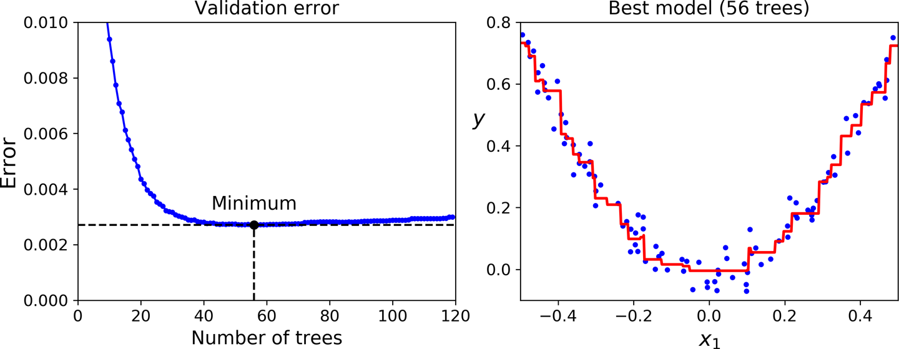

[Chapter 7. ] Ensemble Learning and Random Forests
=========================================================

Suppose[]{#idm45728479552728}[]{#idm45728479551720}[]{#idm45728479551048}
you pose a complex question to thousands of random people, then
aggregate their answers. In many cases you will find that this
aggregated answer is better than an expert's answer. This is called the
*wisdom of the crowd*. Similarly, if you aggregate the predictions of a
group of predictors (such as classifiers or regressors), you will often
get better predictions than with the best individual predictor.
A[]{#idm45728479549432} group of predictors is called an *ensemble*;
thus, this technique is called *Ensemble Learning*, and an Ensemble
Learning algorithm[]{#idm45728479547752} is called an *Ensemble method*.

As[]{#idm45728479546184} an example of an Ensemble method, you can train
a group of Decision Tree classifiers, each on a different random subset
of the training set. To make predictions, you obtain the predictions of
all the individual trees, then predict the class that gets the most
votes (see the last exercise in
[Chapter 6](https://learning.oreilly.com/library/view/hands-on-machine-learning/9781492032632/ch06.html#trees_chapter)).
Such an ensemble of Decision
Trees[]{#idm45728479543944}[]{#idm45728479543000} is called a *Random
Forest*, and despite its simplicity, this is one of the most powerful
Machine Learning algorithms available today.

As discussed in
[Chapter 2](https://learning.oreilly.com/library/view/hands-on-machine-learning/9781492032632/ch02.html#project_chapter),
you will often use Ensemble methods near the end of a project, once you
have already built a few good predictors, to combine them into an even
better predictor. In fact, the winning solutions in Machine Learning
competitions often involve several Ensemble methods (most famously in
the [Netflix Prize competition](http://netflixprize.com/)).

In this chapter we will discuss the most popular Ensemble methods,
including *bagging*, *boosting*, and *stacking*. We will also explore
Random Forests.


Voting Classifiers
==================

Suppose[]{#idm45728479535448}[]{#idm45728479534440} you have trained a
few classifiers, each one achieving about 80% accuracy. You may have a
Logistic Regression classifier, an SVM classifier, a Random Forest
classifier, a K-Nearest Neighbors classifier, and perhaps a few more
(see
[Figure 7-1](https://learning.oreilly.com/library/view/hands-on-machine-learning/9781492032632/ch08.html#voting_classifier_training_diagram)).


A very simple way to create an even better classifier is to aggregate
the predictions of each classifier and predict the class that gets the
most votes. This[]{#idm45728479529672}[]{#idm45728479528904}
majority-vote classifier is called a *hard voting* classifier (see
[Figure 7-2](https://learning.oreilly.com/library/view/hands-on-machine-learning/9781492032632/ch08.html#voting_classifier_prediction_diagram)).


Somewhat surprisingly, this voting classifier often achieves a higher
accuracy than[]{#idm45728479524392}[]{#idm45728479523688} the best
classifier in the ensemble. In fact, even if each classifier is a *weak
learner* (meaning it does only slightly better than random guessing),
the ensemble can still be a *strong learner* (achieving high accuracy),
provided there are a sufficient number of weak learners and they are
sufficiently diverse.

How is this possible? The following analogy can help shed some light on
this mystery. Suppose you have a slightly biased coin that has a 51%
chance of coming up heads and 49% chance of coming up tails. If you toss
it 1,000 times, you will generally get more or less 510 heads and 490
tails, and hence a majority of heads. If you do the math, you will find
that the probability of obtaining a majority of heads after 1,000 tosses
is close to 75%. The more you toss the coin, the higher the probability
(e.g., with 10,000 tosses, the probability climbs over 97%).
This[]{#idm45728479520856} is due to the *law of large numbers*: as you
keep tossing the coin, the ratio of heads gets closer and closer to the
probability of heads (51%).
[Figure 7-3](https://learning.oreilly.com/library/view/hands-on-machine-learning/9781492032632/ch08.html#law_of_large_numbers_plot)
shows 10 series of biased coin tosses. You can see that as the number of
tosses increases, the ratio of heads approaches 51%. Eventually all 10
series end up so close to 51% that they are consistently above 50%.


Similarly, suppose you build an ensemble containing 1,000 classifiers
that are individually correct only 51% of the time (barely better than
random guessing). If you predict the majority voted class, you can hope
for up to 75% accuracy! However, this is only true if all classifiers
are perfectly independent, making uncorrelated errors, which is clearly
not the case because they are trained on the same data. They are likely
to make the same types of errors, so there will be many majority votes
for the wrong class, reducing the ensemble's accuracy.


###### Tip

Ensemble methods[]{#idm45728479514408} work best when the predictors are
as independent from one another as possible. One way to get diverse
classifiers is to train them using very different algorithms. This
increases the chance that they will make very different types of errors,
improving the ensemble's accuracy.


The[]{#idm45728479512472} following code creates and trains a voting
classifier in Scikit-Learn, composed of three diverse classifiers (the
training set is the moons dataset, introduced in
[Chapter 5](https://learning.oreilly.com/library/view/hands-on-machine-learning/9781492032632/ch05.html#svm_chapter)):

``` {data-type="programlisting" code-language="python"}
from sklearn.ensemble import RandomForestClassifier
from sklearn.ensemble import VotingClassifier
from sklearn.linear_model import LogisticRegression
from sklearn.svm import SVC

log_clf = LogisticRegression()
rnd_clf = RandomForestClassifier()
svm_clf = SVC()

voting_clf = VotingClassifier(
    estimators=[('lr', log_clf), ('rf', rnd_clf), ('svc', svm_clf)],
    voting='hard')
voting_clf.fit(X_train, y_train)
```

Let's look at each classifier's accuracy on the test set:

``` {data-type="programlisting" code-language="pycon"}
>>> from sklearn.metrics import accuracy_score
>>> for clf in (log_clf, rnd_clf, svm_clf, voting_clf):
...     clf.fit(X_train, y_train)
...     y_pred = clf.predict(X_test)
...     print(clf.__class__.__name__, accuracy_score(y_test, y_pred))
...
LogisticRegression 0.864
RandomForestClassifier 0.896
SVC 0.888
VotingClassifier 0.904
```

There you have it! The voting classifier slightly outperforms all the
individual [classifiers]{.keep-together}.

If[]{#idm45728479399656} all classifiers are able to estimate class
probabilities (i.e., they all have a `predict_proba()` method), then you
can tell Scikit-Learn to predict the class with the highest class
probability, averaged over all the individual classifiers. This is
called *soft voting*. It often achieves higher performance than hard
voting because it gives more weight to highly confident votes. All you
need to do is replace `voting="hard"` with `voting="soft"` and ensure
that all classifiers can estimate class probabilities. This is not the
case for the `SVC` class by default, so you need to set its
`probability` hyperparameter to `True` (this will make the `SVC` class
use cross-validation to estimate class probabilities, slowing down
training, and it will add a `predict_proba()` method). If you modify the
preceding code to use soft voting, you will find that the voting
classifier achieves over 91.2% accuracy!


Bagging and Pasting
===================

One[]{#ELbag07}[]{#idm45728479336664}[]{#idm45728479335720} way to get a
diverse set of classifiers is to use very different training algorithms,
as just discussed. Another approach is to use the same training
algorithm for every predictor and train them on different random subsets
of the training set. When sampling is performed *with* replacement, this
method is called
[*bagging*](https://homl.info/20)^[1](https://learning.oreilly.com/library/view/hands-on-machine-learning/9781492032632/ch07.html#idm45728479333256){#idm45728479333256-marker
.totri-footnote}^ (short for *bootstrap
aggregating*^[2](https://learning.oreilly.com/library/view/hands-on-machine-learning/9781492032632/ch07.html#idm45728479331896){#idm45728479331896-marker
.totri-footnote}^). When sampling is performed *without* replacement, it
is called
[*pasting*](https://homl.info/21).^[3](https://learning.oreilly.com/library/view/hands-on-machine-learning/9781492032632/ch07.html#idm45728479329528){#idm45728479329528-marker
.totri-footnote}^

In other words, both bagging and pasting allow training instances to be
sampled several times across multiple predictors, but only bagging
allows training instances to be sampled several times for the same
predictor. This sampling and training process is represented in
[Figure 7-4](https://learning.oreilly.com/library/view/hands-on-machine-learning/9781492032632/ch08.html#bagging_training_diagram).


Once all predictors are trained, the ensemble can make a prediction for
a new instance by simply aggregating the predictions of all predictors.
The aggregation function is[]{#idm45728479324280} typically the
*statistical mode* (i.e., the most frequent prediction, just like a hard
voting classifier) for classification, or the average for regression.
Each individual predictor has a higher bias than if it were trained on
the original training set, but aggregation reduces both bias and
variance.^[4](https://learning.oreilly.com/library/view/hands-on-machine-learning/9781492032632/ch07.html#idm45728479322744){#idm45728479322744-marker
.totri-footnote}^ Generally, the net result is that the ensemble has a
similar bias but a lower variance than a single predictor trained on the
original training set.

As you can see in
[Figure 7-4](https://learning.oreilly.com/library/view/hands-on-machine-learning/9781492032632/ch08.html#bagging_training_diagram),
predictors can all be trained in parallel, via different CPU cores or
even different servers. Similarly, predictions can be made in parallel.
This is one of the reasons bagging and pasting are such popular methods:
they scale very well.


Bagging and Pasting in Scikit-Learn
-----------------------------------

Scikit-Learn[]{#idm45728479317640}[]{#idm45728479316360} offers a simple
API for both bagging and pasting with the `BaggingClassifier` class (or
`BaggingRegressor` for regression). The following code trains an
ensemble of 500 Decision Tree
classifiers:^[5](https://learning.oreilly.com/library/view/hands-on-machine-learning/9781492032632/ch07.html#idm45728479314344){#idm45728479314344-marker
.totri-footnote}^ each is trained on 100 training instances randomly
sampled from the training set with replacement (this is an example of
bagging, but if you want to use pasting instead, just set
`bootstrap=False`). The `n_jobs` parameter tells Scikit-Learn the number
of CPU cores to use for training and predictions ([`–1`]{.keep-together}
tells Scikit-Learn to use all available cores):

``` {data-type="programlisting" code-language="python"}
from sklearn.ensemble import BaggingClassifier
from sklearn.tree import DecisionTreeClassifier

bag_clf = BaggingClassifier(
    DecisionTreeClassifier(), n_estimators=500,
    max_samples=100, bootstrap=True, n_jobs=-1)
bag_clf.fit(X_train, y_train)
y_pred = bag_clf.predict(X_test)
```


###### Note

The `BaggingClassifier` automatically performs soft voting instead of
hard voting if the base classifier can estimate class probabilities
(i.e., if it has a `predict_proba()` method), which is the case with
Decision Tree classifiers.


[Figure 7-5](https://learning.oreilly.com/library/view/hands-on-machine-learning/9781492032632/ch08.html#decision_tree_without_and_with_bagging_plot)
compares the decision boundary of a single Decision Tree with the
decision boundary of a bagging ensemble of 500 trees (from the preceding
code), both trained on the moons dataset. As you can see, the ensemble's
predictions will likely generalize much better than the single Decision
Tree's predictions: the ensemble has a comparable bias but a smaller
variance (it makes roughly the same number of errors on the training
set, but the decision boundary is less irregular).


Bootstrapping introduces a bit more diversity in the subsets that each
predictor is trained on, so bagging ends up with a slightly higher bias
than pasting; but the extra diversity also means that the predictors end
up being less correlated, so the ensemble's variance is reduced.
Overall, bagging often results in better models, which explains why it
is generally preferred. However, if you have spare time and CPU power,
you can use cross-validation to evaluate both bagging and pasting and
select the one that works best.


Out-of-Bag Evaluation
---------------------

With[]{#idm45728479225688}[]{#idm45728479224680} bagging, some instances
may be sampled several times for any given predictor, while others may
not be sampled at all. By default a `BaggingClassifier` samples *m*
training instances with replacement (`bootstrap=True`), where *m* is the
size of the training set. This means that only about 63% of the training
instances are sampled on average for each
predictor.^[6](https://learning.oreilly.com/library/view/hands-on-machine-learning/9781492032632/ch07.html#idm45728479221624){#idm45728479221624-marker
.totri-footnote}^ The remaining 37% of the training instances that are
not sampled are called *out-of-bag* (oob) instances. Note that they are
not the same 37% for all predictors.

Since a predictor never sees the oob instances during training, it can
be evaluated on these instances, without the need for a separate
validation set. You can evaluate the ensemble itself by averaging out
the oob evaluations of each predictor.

In Scikit-Learn, you can set `oob_score=True` when creating a
`BaggingClassifier` to request an automatic oob evaluation after
training. The following code demonstrates this. The resulting evaluation
score is available through the `oob_score_` variable:

``` {.pagebreak-before data-type="programlisting" code-language="pycon"}
>>> bag_clf = BaggingClassifier(
...     DecisionTreeClassifier(), n_estimators=500,
...     bootstrap=True, n_jobs=-1, oob_score=True)
...
>>> bag_clf.fit(X_train, y_train)
>>> bag_clf.oob_score_
0.90133333333333332
```

According to this oob evaluation, this `BaggingClassifier` is likely to
achieve about 90.1% accuracy on the test set. Let's verify this:

``` {data-type="programlisting" code-language="pycon"}
>>> from sklearn.metrics import accuracy_score
>>> y_pred = bag_clf.predict(X_test)
>>> accuracy_score(y_test, y_pred)
0.91200000000000003
```

We get 91.2% accuracy on the test set---close enough!

The oob decision function for each training instance is also available
through the `oob_decision_function_` variable. In this case (since the
base estimator has a `predict_proba()` method), the decision function
returns the class probabilities for each training instance. For example,
the oob evaluation estimates that the first training instance has a
68.25% probability of belonging to the positive class (and 31.75% of
belonging to the[]{#idm45728479126168} negative class):

``` {data-type="programlisting" code-language="pycon"}
>>> bag_clf.oob_decision_function_
array([[0.31746032, 0.68253968],
       [0.34117647, 0.65882353],
       [1.        , 0.        ],
       ...
       [1.        , 0.        ],
       [0.03108808, 0.96891192],
       [0.57291667, 0.42708333]])
```


Random Patches and Random Subspaces
===================================

The `BaggingClassifier`
class[]{#idm45728479105128}[]{#idm45728479104152} supports sampling the
features as well. Sampling is controlled by two hyperparameters:
`max_features` and `bootstrap_features`. They work the same way as
`max_samples` and `bootstrap`, but for feature sampling instead of
instance sampling. Thus, each predictor will be trained on a random
subset of the input features.

This technique is particularly useful when you are dealing with
high-dimensional inputs (such as images). Sampling both training
instances and features is called the [*Random Patches*
method](https://homl.info/22).^[7](https://learning.oreilly.com/library/view/hands-on-machine-learning/9781492032632/ch07.html#idm45728479068232){#idm45728479068232-marker
.totri-footnote}^ Keeping all training instances (by setting
`bootstrap=False` and `max_samples=1.0`) but sampling features (by
setting `bootstrap_features` to `True` and/or `max_features` to a value
smaller than `1.0`) is called the [*Random Subspaces*
method](https://homl.info/23).^[8](https://learning.oreilly.com/library/view/hands-on-machine-learning/9781492032632/ch07.html#idm45728479037368){#idm45728479037368-marker
.totri-footnote}^

Sampling features results in even more predictor diversity, trading a
bit more bias for a lower variance.


Random Forests
==============

As we have[]{#idm45728479033912}[]{#idm45728479032904} discussed, a
[Random
Forest](https://homl.info/24)^[9](https://learning.oreilly.com/library/view/hands-on-machine-learning/9781492032632/ch07.html#idm45728479031272){#idm45728479031272-marker
.totri-footnote}^ is an ensemble of Decision Trees, generally trained
via the bagging method (or sometimes pasting), typically with
`max_samples` set to the size of the training set. Instead of building a
`BaggingClassifier` and passing it a `DecisionTreeClassifier`, you can
instead use the `RandomForestClassifier` class, which is more convenient
and optimized for Decision
Trees^[10](https://learning.oreilly.com/library/view/hands-on-machine-learning/9781492032632/ch07.html#idm45728479028376){#idm45728479028376-marker}^
(similarly, there is a `RandomForestRegressor` class for regression
tasks). The following code uses all available CPU cores to train a
Random Forest classifier with 500 trees (each limited to maximum 16
nodes):

``` {data-type="programlisting" code-language="python"}
from sklearn.ensemble import RandomForestClassifier

rnd_clf = RandomForestClassifier(n_estimators=500, max_leaf_nodes=16, n_jobs=-1)
rnd_clf.fit(X_train, y_train)

y_pred_rf = rnd_clf.predict(X_test)
```

With a few exceptions, a `RandomForestClassifier` has all the
hyperparameters of a `DecisionTreeClassifier` (to control how trees are
grown), plus all the hyperparameters of a `BaggingClassifier` to control
the ensemble
itself.^[11](https://learning.oreilly.com/library/view/hands-on-machine-learning/9781492032632/ch07.html#idm45728478969464){#idm45728478969464-marker}^

The Random Forest algorithm introduces extra randomness when growing
trees; instead of searching for the very best feature when splitting a
node (see
[Chapter 6](https://learning.oreilly.com/library/view/hands-on-machine-learning/9781492032632/ch06.html#trees_chapter)),
it searches for the best feature among a random subset of features. The
algorithm results in greater tree diversity, which (again) trades a
higher bias for a lower variance, generally yielding an overall better
model. The following `BaggingClassifier` is equivalent to the previous
`RandomForestClassifier`:

``` {data-type="programlisting" code-language="python"}
bag_clf = BaggingClassifier(
    DecisionTreeClassifier(max_features="auto", max_leaf_nodes=16),
    n_estimators=500, max_samples=1.0, bootstrap=True, n_jobs=-1)
```


Extra-Trees
-----------

When[]{#idm45728478901400}[]{#idm45728478900392}[]{#idm45728478899720}
you are growing a tree in a Random Forest, at each node only a random
subset of the features is considered for splitting (as discussed
earlier). It is possible to make trees even more random by also using
random thresholds for each feature rather than searching for the best
possible thresholds (like regular Decision Trees do).

A[]{#idm45728478897912} forest of such extremely random trees is called
an [*Extremely Randomized Trees*](https://homl.info/25)
ensemble^[12](https://learning.oreilly.com/library/view/hands-on-machine-learning/9781492032632/ch07.html#idm45728478896200){#idm45728478896200-marker}^
(or *Extra-Trees* for short). Once again, this technique trades more
bias for a lower variance. It also makes Extra-Trees much faster to
train than regular Random Forests, because finding the best possible
threshold for each feature at every node is one of the most
time-consuming tasks of growing a tree.

You[]{#idm45728478893768} can create an Extra-Trees classifier using
Scikit-Learn's `ExtraTreesClassifier` class. Its API is identical to the
`RandomForestClassifier` class. Similarly, the `ExtraTreesRegressor`
class has the same API as the `RandomForestRegressor` class.


###### Tip

It is hard to tell in advance whether a `RandomForestClassifier` will
perform better or worse than an `ExtraTreesClassifier`. Generally, the
only way to know is to try both and compare them using cross-validation
(tuning the hyperparameters using grid search).


Feature Importance
------------------

Yet[]{#idm45728478887160} another great quality of Random Forests is
that they make it easy to measure the relative importance of each
feature. Scikit-Learn[]{#idm45728478885880} measures a feature's
importance by looking at how much the tree nodes that use that feature
reduce impurity on average (across all trees in the forest). More
precisely, it is a weighted average, where each node's weight is equal
to the number of training samples that are associated with it (see
[Chapter 6](https://learning.oreilly.com/library/view/hands-on-machine-learning/9781492032632/ch06.html#trees_chapter)).

Scikit-Learn computes this score automatically for each feature after
training, then it scales the results so that the sum of all importances
is equal to 1. You can access the result using the
`feature_importances_` variable. For example, the following code trains
a `RandomForestClassifier` on the iris dataset (introduced in
[Chapter 4](https://learning.oreilly.com/library/view/hands-on-machine-learning/9781492032632/ch04.html#linear_models_chapter))
and outputs each feature's importance. It seems that the most important
features are the petal length (44%) and width (42%), while sepal length
and width are rather unimportant in comparison (11% and 2%,
respectively):

``` {data-type="programlisting" code-language="pycon"}
>>> from sklearn.datasets import load_iris
>>> iris = load_iris()
>>> rnd_clf = RandomForestClassifier(n_estimators=500, n_jobs=-1)
>>> rnd_clf.fit(iris["data"], iris["target"])
>>> for name, score in zip(iris["feature_names"], rnd_clf.feature_importances_):
...     print(name, score)
...
sepal length (cm) 0.112492250999
sepal width (cm) 0.0231192882825
petal length (cm) 0.441030464364
petal width (cm) 0.423357996355
```

Similarly, if you train a Random Forest classifier on the MNIST dataset
(introduced in
[Chapter 3](https://learning.oreilly.com/library/view/hands-on-machine-learning/9781492032632/ch03.html#classification_chapter))
and plot each pixel's importance, you get the image represented in
[Figure 7-6](https://learning.oreilly.com/library/view/hands-on-machine-learning/9781492032632/ch08.html#mnist_feature_importance_plot).


Random Forests are very handy to get a quick understanding of what
features actually matter, in particular if you need to perform feature
selection.


Boosting
========

*Boosting* (originally called *hypothesis boosting*)
refers[]{#idm45728478784648}[]{#ELboost07}[]{#idm45728478782696} to any
Ensemble method that can combine several weak learners into a strong
learner. The general idea of most boosting methods is to train
predictors sequentially, each trying to correct its predecessor. There
are many boosting methods available, but by far the most popular are
[*AdaBoost*](https://homl.info/26)^[13](https://learning.oreilly.com/library/view/hands-on-machine-learning/9781492032632/ch07.html#idm45728478780632){#idm45728478780632-marker}^
(short for *Adaptive Boosting*) []{#idm45728478779032}and *Gradient
Boosting*. Let's start with AdaBoost.


AdaBoost
--------

One[]{#idm45728478775704}[]{#idm45728478774696} way for a new predictor
to correct its predecessor is to pay a bit more attention to the
training instances that the predecessor underfitted. This results in new
predictors focusing more and more on the hard cases. This is the
technique used by [AdaBoost]{.keep-together}.

For example, when training an[]{#idm45728478772488} AdaBoost classifier,
the algorithm first trains a base classifier (such as a Decision Tree)
and uses it to make predictions on the training set. The algorithm then
increases the relative weight of misclassified training instances. Then
it trains a second classifier, using the updated weights, and again
makes predictions on the training set, updates the instance weights, and
so on (see
[Figure 7-7](https://learning.oreilly.com/library/view/hands-on-machine-learning/9781492032632/ch08.html#adaboost_training_diagram)).


[Figure 7-8](https://learning.oreilly.com/library/view/hands-on-machine-learning/9781492032632/ch08.html#boosting_plot)
shows the decision boundaries of five consecutive predictors on the
moons dataset (in this example, each predictor is a highly regularized
SVM classifier with an RBF
kernel^[14](https://learning.oreilly.com/library/view/hands-on-machine-learning/9781492032632/ch07.html#idm45728478766824){#idm45728478766824-marker}^).
The first classifier gets many instances wrong, so their weights get
boosted. The second classifier therefore does a better job on these
instances, and so on. The plot on the right represents the same sequence
of predictors, except that the learning rate is halved (i.e., the
misclassified instance weights are boosted half as much at every
iteration). As you can see, this sequential learning technique has some
similarities with Gradient Descent, except that instead of tweaking a
single predictor's parameters to minimize a cost function, AdaBoost adds
predictors to the ensemble, gradually making it better.


Once all predictors are trained, the ensemble makes predictions very
much like bagging or pasting, except that predictors have different
weights depending on their overall accuracy on the weighted training
set.


###### Warning

There is one important drawback to this sequential learning technique:
it cannot be parallelized (or only partially), since each predictor can
only be trained after the previous predictor has been trained and
evaluated. As a result, it does not scale as well as bagging or pasting.


Let's take a closer look at the AdaBoost algorithm. Each instance weight
*w*^(*i*)^ is initially set to 1/*m*. A first predictor is trained, and
its weighted error rate *r*~1~ is computed on the training set; see
[Equation
7-1](https://learning.oreilly.com/library/view/hands-on-machine-learning/9781492032632/ch08.html#weighted_error_rate).


##### [Equation 7-1. ] Weighted error rate of the j^th^ predictor

$$r_{j} = \frac{\sum\limits_{\binom{i = 1}{{\hat{y}}_{j}^{(i)} \neq y^{(i)}}}^{m}w^{(i)}}{\sum\limits_{i = 1}^{m}w^{(i)}}\text{where}{\hat{y}}_{j}^{(i)}\text{is}\text{the} j^{\text{th}}\text{predictor’s}\text{prediction}\text{for}\text{the} i^{\text{th}}\text{instance.}$$


The predictor's weight *α*~*j*~ is then computed using [Equation
7-2](https://learning.oreilly.com/library/view/hands-on-machine-learning/9781492032632/ch08.html#predictor_weight),
where *η* is the learning rate hyperparameter (defaults to
1).^[15](https://learning.oreilly.com/library/view/hands-on-machine-learning/9781492032632/ch07.html#idm45728478683224){#idm45728478683224-marker}^
The more accurate the predictor is, the higher its weight will be. If it
is just guessing randomly, then its weight will be close to zero.
However, if it is most often wrong (i.e., less accurate than random
guessing), then its weight will be negative.


##### [Equation 7-2. ] Predictor weight

$$\begin{array}{r}
{\alpha_{j} = \eta\log\frac{1 - r_{j}}{r_{j}}} \\
\end{array}$$


Next, the AdaBoost algorithm updates the instance weights, using
[Equation
7-3](https://learning.oreilly.com/library/view/hands-on-machine-learning/9781492032632/ch08.html#instance_weight_update),
which boosts the weights of the misclassified instances.


##### [Equation 7-3. ] Weight update rule

$$\begin{array}{cl}
 & {\text{for} i = 1,2,\cdots,m} \\
 & \left. w^{(i)}\leftarrow\begin{cases}
w^{(i)} & {\text{if}{\hat{y_{j}}}^{(i)} = y^{(i)}} \\
{w^{(i)}\exp\left( \alpha_{j} \right)} & {\text{if}{\hat{y_{j}}}^{(i)} \neq y^{(i)}} \\
\end{cases} \right. \\
\end{array}$$


Then all the instance weights are normalized (i.e., divided by
$\sum_{i = 1}^{m}w^{(i)}$).

Finally, a new predictor is trained using the updated weights, and the
whole process is repeated (the new predictor's weight is computed, the
instance weights are updated, then another predictor is trained, and so
on). The algorithm stops when the desired number of predictors is
reached, or when a perfect predictor is found.

To make predictions, AdaBoost simply computes the predictions of all the
predictors and weighs them using the predictor weights *α*~*j*~. The
predicted class is the one that receives the majority of weighted votes
(see [Equation
7-4](https://learning.oreilly.com/library/view/hands-on-machine-learning/9781492032632/ch08.html#adaboost_prediction)).


##### [Equation 7-4. ] AdaBoost predictions

$$\hat{y}\left( \mathbf{x} \right) = \operatorname{argmax}\limits_{k}{\sum\limits_{\binom{j = 1}{{\hat{y}}_{j}{(\mathbf{x})} = k}}^{N}\alpha_{j}}\text{where} N\text{is}\text{the}\text{number}\text{of}\text{predictors.}$$


Scikit-Learn[]{#idm45728478592632}[]{#idm45728478591928} uses a
multiclass version of AdaBoost called
[*SAMME*](https://homl.info/27)^[16](https://learning.oreilly.com/library/view/hands-on-machine-learning/9781492032632/ch07.html#idm45728478590200){#idm45728478590200-marker}^
(which stands for *Stagewise Additive Modeling using a Multiclass
Exponential loss function*). When there are just two classes, SAMME is
equivalent to AdaBoost. If the predictors can estimate class
probabilities (i.e., if they have a `predict_proba()` method),
Scikit-Learn can use a variant of SAMME called *SAMME.R* (the *R* stands
for "Real"), which relies on class probabilities rather than predictions
and generally performs better.

The[]{#idm45728478586568} following code trains an AdaBoost classifier
based on 200 *Decision Stumps* using Scikit-Learn's `AdaBoostClassifier`
class (as you might expect, there is also an `AdaBoostRegressor` class).
A Decision Stump is a Decision Tree with `max_depth=1`---in other words,
a tree composed of a single decision node plus two leaf nodes. This is
the default base estimator for the `AdaBoostClassifier` class:

``` {data-type="programlisting" code-language="python"}
from sklearn.ensemble import AdaBoostClassifier

ada_clf = AdaBoostClassifier(
    DecisionTreeClassifier(max_depth=1), n_estimators=200,
    algorithm="SAMME.R", learning_rate=0.5)
ada_clf.fit(X_train, y_train)
```


###### Tip

If your AdaBoost ensemble is overfitting the training set, you can try
reducing the number of estimators or more strongly regularizing the base
estimator.


Gradient Boosting
-----------------

Another[]{#idm45728478548536}[]{#idm45728478547640} very popular
boosting algorithm is [*Gradient
Boosting*](https://homl.info/28).^[17](https://learning.oreilly.com/library/view/hands-on-machine-learning/9781492032632/ch07.html#idm45728478546024){#idm45728478546024-marker}^
Just like AdaBoost, Gradient Boosting works by sequentially adding
predictors to an ensemble, each one correcting its predecessor. However,
instead of tweaking the instance weights at every iteration like
AdaBoost does, this method tries to fit the new
predictor[]{#idm45728478543640} to the *residual errors* made by the
previous predictor.

Let's[]{#idm45728478542136}[]{#idm45728478541400} go through a simple
regression example, using Decision Trees as the base predictors (of
course, Gradient Boosting also works great with regression tasks). This
is called *Gradient Tree Boosting*, or *Gradient Boosted Regression
Trees* (GBRT). First, let's fit a `DecisionTreeRegressor` to the
training set (for example, a noisy quadratic training set):

``` {data-type="programlisting" code-language="python"}
from sklearn.tree import DecisionTreeRegressor

tree_reg1 = DecisionTreeRegressor(max_depth=2)
tree_reg1.fit(X, y)
```

Next, we'll train a second `DecisionTreeRegressor` on the residual
errors made by the first predictor:

``` {data-type="programlisting" code-language="python"}
y2 = y - tree_reg1.predict(X)
tree_reg2 = DecisionTreeRegressor(max_depth=2)
tree_reg2.fit(X, y2)
```

Then we train a third regressor on the residual errors made by the
second predictor:

``` {data-type="programlisting" code-language="python"}
y3 = y2 - tree_reg2.predict(X)
tree_reg3 = DecisionTreeRegressor(max_depth=2)
tree_reg3.fit(X, y3)
```

Now we have an ensemble containing three trees. It can make predictions
on a new instance simply by adding up the predictions of all the trees:

``` {data-type="programlisting" code-language="python"}
y_pred = sum(tree.predict(X_new) for tree in (tree_reg1, tree_reg2, tree_reg3))
```

[Figure 7-9](https://learning.oreilly.com/library/view/hands-on-machine-learning/9781492032632/ch08.html#gradient_boosting_plot)
represents the predictions of these three trees in the left column, and
the ensemble's predictions in the right column. In the first row, the
ensemble has just one tree, so its predictions are exactly the same as
the first tree's predictions. In the second row, a new tree is trained
on the residual errors of the first tree. On the right you can see that
the ensemble's predictions are equal to the sum of the predictions of
the first two trees. Similarly, in the third row another tree is trained
on the residual errors of the second tree. You can see that the
ensemble's predictions gradually get better as trees are added to the
ensemble.

A[]{#idm45728478372984} simpler way to train GBRT ensembles is to use
Scikit-Learn's `GradientBoostingRegressor` class. Much like the
`RandomForestRegressor` class, it has hyperparameters to control the
growth of Decision Trees (e.g., `max_depth`, `min_samples_leaf`), as
well as hyperparameters to control the ensemble training, such as the
number of trees (`n_estimators`). The following code creates the same
ensemble as the previous one:

``` {data-type="programlisting" code-language="python"}
from sklearn.ensemble import GradientBoostingRegressor

gbrt = GradientBoostingRegressor(max_depth=2, n_estimators=3, learning_rate=1.0)
gbrt.fit(X, y)
```


The `learning_rate` hyperparameter scales the contribution of each tree.
If you set it to a low value, such as `0.1`, you will need more trees in
the ensemble to fit the training set, but the predictions will usually
generalize better. This[]{#idm45728478282568}[]{#idm45728478281864} is a
regularization technique called *shrinkage*.
[Figure 7-10](https://learning.oreilly.com/library/view/hands-on-machine-learning/9781492032632/ch08.html#gbrt_learning_rate_plot)
shows two GBRT ensembles trained with a low learning rate: the one on
the left does not have enough trees to fit the training set, while the
one on the right has too many trees and overfits the training set.


In order to find the optimal number of trees, you can use early stopping
(see
[Chapter 4](https://learning.oreilly.com/library/view/hands-on-machine-learning/9781492032632/ch04.html#linear_models_chapter)).
A simple way to implement this is to use the `staged_predict()` method:
it returns an iterator over the predictions made by the ensemble at each
stage of training (with one tree, two trees, etc.). The following code
trains a GBRT ensemble with 120 trees, then measures the validation
error at each stage of training to find the optimal number of trees, and
finally trains another GBRT ensemble using the optimal number of trees:

``` {data-type="programlisting" code-language="python"}
import numpy as np
from sklearn.model_selection import train_test_split
from sklearn.metrics import mean_squared_error

X_train, X_val, y_train, y_val = train_test_split(X, y)

gbrt = GradientBoostingRegressor(max_depth=2, n_estimators=120)
gbrt.fit(X_train, y_train)

errors = [mean_squared_error(y_val, y_pred)
          for y_pred in gbrt.staged_predict(X_val)]
bst_n_estimators = np.argmin(errors) + 1

gbrt_best = GradientBoostingRegressor(max_depth=2,n_estimators=bst_n_estimators)
gbrt_best.fit(X_train, y_train)
```

The validation errors are represented on the left of
[Figure 7-11](https://learning.oreilly.com/library/view/hands-on-machine-learning/9781492032632/ch08.html#early_stopping_gbrt_plot),
and the best model's predictions are represented on the right.



It is also possible to implement early stopping by actually stopping
training early (instead of training a large number of trees first and
then looking back to find the optimal number). You can do so by setting
`warm_start=True`, which makes Scikit-Learn[]{#idm45728478143528} keep
existing trees when the `fit()` method is called, allowing incremental
training. The following code stops training when the validation error
does not improve for five iterations in a row:

``` {data-type="programlisting" code-language="python"}
gbrt = GradientBoostingRegressor(max_depth=2, warm_start=True)

min_val_error = float("inf")
error_going_up = 0
for n_estimators in range(1, 120):
    gbrt.n_estimators = n_estimators
    gbrt.fit(X_train, y_train)
    y_pred = gbrt.predict(X_val)
    val_error = mean_squared_error(y_val, y_pred)
    if val_error < min_val_error:
        min_val_error = val_error
        error_going_up = 0
    else:
        error_going_up += 1
        if error_going_up == 5:
            break  # early stopping
```

The `GradientBoostingRegressor` class also supports a `subsample`
hyperparameter, which specifies the fraction of training instances to be
used for training each tree. For example, if `subsample=0.25`, then each
tree is trained on 25% of the training instances, selected randomly. As
you can probably guess by now, this technique trades a higher bias for a
lower variance. It also speeds up training considerably.
This[]{#idm45728477999112} is called *Stochastic Gradient Boosting*.


###### Note

It is possible to use Gradient Boosting with other cost functions. This
is controlled by the `loss` hyperparameter (see Scikit-Learn's
documentation for more details).


It[]{#idm45728477995976} is worth noting that an optimized
implementation of Gradient Boosting is available in the popular Python
library [XGBoost](https://github.com/dmlc/xgboost), which stands for
Extreme Gradient Boosting. This package was initially developed by
Tianqi Chen as part of the Distributed (Deep) Machine Learning Community
(DMLC), and it aims to be extremely fast, scalable, and portable. In
fact, XGBoost is often an important component of the winning entries in
ML competitions. XGBoost's API is quite similar to Scikit-Learn's:

``` {data-type="programlisting" code-language="python"}
import xgboost

xgb_reg = xgboost.XGBRegressor()
xgb_reg.fit(X_train, y_train)
y_pred = xgb_reg.predict(X_val)
```

XGBoost also offers several nice features, such as automatically taking
care of early stopping:

``` {data-type="programlisting" code-language="python"}
xgb_reg.fit(X_train, y_train,
            eval_set=[(X_val, y_val)], early_stopping_rounds=2)
y_pred = xgb_reg.predict(X_val)
```

You should definitely check it out![]{#idm45728477955608}


Stacking
========

The[]{#idm45728477885640}[]{#idm45728477884632}[]{#idm45728477883960}
last Ensemble method we will discuss in this chapter is called
*stacking* (short for [*stacked
generalization*](https://homl.info/29)).^[18](https://learning.oreilly.com/library/view/hands-on-machine-learning/9781492032632/ch07.html#idm45728477881896){#idm45728477881896-marker}^
It is based on a simple idea: instead of using trivial functions (such
as hard voting) to aggregate the predictions of all predictors in an
ensemble, why don't we train a model to perform this aggregation?
[Figure 7-12](https://learning.oreilly.com/library/view/hands-on-machine-learning/9781492032632/ch08.html#blending_prediction_diagram)
shows such an ensemble performing a regression task on a new instance.
Each of the bottom three predictors predicts a different value (3.1,
2.7, and 2.9), and then the final
predictor[]{#idm45728477879592}[]{#idm45728477878920} (called a
*blender*, or a *meta learner*) takes these predictions as inputs and
makes the final prediction (3.0).


To train the blender, a common approach is to use a hold-out
set.^[19](https://learning.oreilly.com/library/view/hands-on-machine-learning/9781492032632/ch07.html#idm45728477874760){#idm45728477874760-marker}^
Let's see how it works. First, the training set is split into two
subsets. The first subset is used to train the predictors in the first
layer (see
[Figure 7-13](https://learning.oreilly.com/library/view/hands-on-machine-learning/9781492032632/ch08.html#blending_layer_1_training_diagram)).


Next, the first layer's predictors are used to make predictions on the
second (held-out) set (see
[Figure 7-14](https://learning.oreilly.com/library/view/hands-on-machine-learning/9781492032632/ch08.html#blending_layer_2_training_diagram)).
This ensures that the predictions are "clean," since the predictors
never saw these instances during training. For each instance in the
hold-out set, there are three predicted values. We can create a new
training set using these predicted values as input features (which makes
this new training set 3D), and keeping the target values. The blender is
trained on this new training set, so it learns to predict the target
value, given the first layer's predictions.


It is actually possible to train several different blenders this way
(e.g., one using Linear Regression, another using Random Forest
Regression), to get a whole layer of blenders. The trick is to split the
training set into three subsets: the first one is used to train the
first layer, the second one is used to create the training set used to
train the second layer (using predictions made by the predictors of the
first layer), and the third one is used to create the training set to
train the third layer (using predictions made by the predictors of the
second layer). Once this is done, we can make a prediction for a new
instance by going through each layer sequentially, as shown in
[Figure 7-15](https://learning.oreilly.com/library/view/hands-on-machine-learning/9781492032632/ch08.html#multi_layer_blending_diagram).


Unfortunately, Scikit-Learn does not support stacking directly, but it
is not too hard to roll out your own implementation (see the following
exercises). Alternatively, you can use an open source implementation
such as [`DESlib`](https://github.com/Menelau/DESlib).


Exercises
=========

1.  If you have trained five different models on the exact same training
    data, and they all achieve 95% precision, is there any chance that
    you can combine these models to get better results? If so, how? If
    not, why?

2.  What is the difference between hard and soft voting classifiers?

3.  Is it possible to speed up training of a bagging ensemble by
    distributing it across multiple servers? What about pasting
    ensembles, boosting ensembles, Random Forests, or stacking
    ensembles?

4.  What is the benefit of out-of-bag evaluation?

5.  What makes Extra-Trees more random than regular Random Forests? How
    can this extra randomness help? Are Extra-Trees slower or faster
    than regular Random Forests?

6.  If your AdaBoost ensemble underfits the training data, which
    hyperparameters should you tweak and how?

7.  If your Gradient Boosting ensemble overfits the training set, should
    you increase or decrease the learning rate?

8.  Load the MNIST data (introduced in
    [Chapter 3](https://learning.oreilly.com/library/view/hands-on-machine-learning/9781492032632/ch03.html#classification_chapter)),
    and split it into a training set, a validation set, and a test set
    (e.g., use 50,000 instances for training, 10,000 for validation, and
    10,000 for testing). Then train various classifiers, such as a
    Random Forest classifier, an Extra-Trees classifier, and an SVM
    classifier. Next, try to combine them into an ensemble that
    outperforms each individual classifier on the validation set, using
    soft or hard voting. Once you have found one, try it on the test
    set. How much better does it perform compared to the individual
    classifiers?

9.  Run the individual classifiers from the previous exercise to make
    predictions on the validation set, and create a new training set
    with the resulting predictions: each training instance is a vector
    containing the set of predictions from all your classifiers for an
    image, and the target is the image's class. Train a classifier on
    this new training set. Congratulations, you have just trained a
    blender, and together with the classifiers it forms a stacking
    ensemble! Now evaluate the ensemble on the test set. For each image
    in the test set, make predictions with all your classifiers, then
    feed the predictions to the blender to get the ensemble's
    predictions. How does it compare to the voting classifier you
    trained earlier?

Solutions to these exercises are available in
[Appendix A](https://learning.oreilly.com/library/view/hands-on-machine-learning/9781492032632/app01.html#solutions_appendix).


^[1](https://learning.oreilly.com/library/view/hands-on-machine-learning/9781492032632/ch07.html#idm45728479333256-marker){.totri-footnote}^
Leo Breiman, "Bagging Predictors," *Machine Learning* 24, no. 2 (1996):
123--140.

^[2](https://learning.oreilly.com/library/view/hands-on-machine-learning/9781492032632/ch07.html#idm45728479331896-marker){.totri-footnote}^
In statistics, resampling with replacement is called *bootstrapping*.

^[3](https://learning.oreilly.com/library/view/hands-on-machine-learning/9781492032632/ch07.html#idm45728479329528-marker){.totri-footnote}^
Leo Breiman, "Pasting Small Votes for Classification in Large Databases
and On-Line," *Machine Learning* 36, no. 1--2 (1999): 85--103.

^[4](https://learning.oreilly.com/library/view/hands-on-machine-learning/9781492032632/ch07.html#idm45728479322744-marker){.totri-footnote}^
Bias and variance were introduced in
[Chapter 4](https://learning.oreilly.com/library/view/hands-on-machine-learning/9781492032632/ch04.html#linear_models_chapter).

^[5](https://learning.oreilly.com/library/view/hands-on-machine-learning/9781492032632/ch07.html#idm45728479314344-marker){.totri-footnote}^
`max_samples` can alternatively be set to a float between 0.0 and 1.0,
in which case the max number of instances to sample is equal to the size
of the training set times `max_samples`.

^[6](https://learning.oreilly.com/library/view/hands-on-machine-learning/9781492032632/ch07.html#idm45728479221624-marker){.totri-footnote}^
As *m* grows, this ratio approaches 1 -- exp(--1) ≈ 63.212%.

^[7](https://learning.oreilly.com/library/view/hands-on-machine-learning/9781492032632/ch07.html#idm45728479068232-marker){.totri-footnote}^
Gilles Louppe and Pierre Geurts, "Ensembles on Random Patches," *Lecture
Notes in Computer Science* 7523 (2012): 346--361.

^[8](https://learning.oreilly.com/library/view/hands-on-machine-learning/9781492032632/ch07.html#idm45728479037368-marker){.totri-footnote}^
Tin Kam Ho, "The Random Subspace Method for Constructing Decision
Forests," *IEEE Transactions on Pattern Analysis and Machine
Intelligence* 20, no. 8 (1998): 832--844.

^[9](https://learning.oreilly.com/library/view/hands-on-machine-learning/9781492032632/ch07.html#idm45728479031272-marker){.totri-footnote}^
Tin Kam Ho, "Random Decision Forests," *Proceedings of the Third
International Conference on Document Analysis and Recognition* 1 (1995):
278.

^[10](https://learning.oreilly.com/library/view/hands-on-machine-learning/9781492032632/ch07.html#idm45728479028376-marker)^
The `BaggingClassifier` class remains useful if you want a bag of
something other than Decision Trees.

^[11](https://learning.oreilly.com/library/view/hands-on-machine-learning/9781492032632/ch07.html#idm45728478969464-marker)^
There are a few notable exceptions: `splitter` is absent (forced to
`"random"`), `presort` is absent (forced to `False`), `max_samples` is
absent (forced to `1.0`), and `base_estimator` is absent (forced to
`DecisionTreeClassifier` with the provided hyperparameters).

^[12](https://learning.oreilly.com/library/view/hands-on-machine-learning/9781492032632/ch07.html#idm45728478896200-marker)^
Pierre Geurts et al., "Extremely Randomized Trees," *Machine Learning*
63, no. 1 (2006): 3--42.

^[13](https://learning.oreilly.com/library/view/hands-on-machine-learning/9781492032632/ch07.html#idm45728478780632-marker)^
Yoav Freund and Robert E. Schapire, "A Decision-Theoretic Generalization
of On-Line Learning and an Application to Boosting," *Journal of
Computer and System Sciences* 55, no. 1 (1997): 119--139.

^[14](https://learning.oreilly.com/library/view/hands-on-machine-learning/9781492032632/ch07.html#idm45728478766824-marker)^
This is just for illustrative purposes. SVMs are generally not good base
predictors for AdaBoost; they are slow and tend to be unstable with it.

^[15](https://learning.oreilly.com/library/view/hands-on-machine-learning/9781492032632/ch07.html#idm45728478683224-marker)^
The original AdaBoost algorithm does not use a learning rate
hyperparameter.

^[16](https://learning.oreilly.com/library/view/hands-on-machine-learning/9781492032632/ch07.html#idm45728478590200-marker)^
For more details, see Ji Zhu et al., "Multi-Class AdaBoost," *Statistics
and Its Interface* 2, no. 3 (2009): 349--360.

^[17](https://learning.oreilly.com/library/view/hands-on-machine-learning/9781492032632/ch07.html#idm45728478546024-marker)^
Gradient Boosting was first introduced in Leo Breiman's 1997 paper
["Arcing the Edge"](https://homl.info/arcing) and was further developed
in the [1999 paper](https://homl.info/gradboost) "Greedy Function
Approximation: A Gradient Boosting Machine" by Jerome H. Friedman.

^[18](https://learning.oreilly.com/library/view/hands-on-machine-learning/9781492032632/ch07.html#idm45728477881896-marker)^
David H. Wolpert, "Stacked Generalization," *Neural Networks* 5, no. 2
(1992): 241--259.

^[19](https://learning.oreilly.com/library/view/hands-on-machine-learning/9781492032632/ch07.html#idm45728477874760-marker)^
Alternatively, it is possible to use out-of-fold predictions. In some
contexts this is called *stacking*, while using a hold-out set is called
*blending*. For many people these terms are synonymous.
